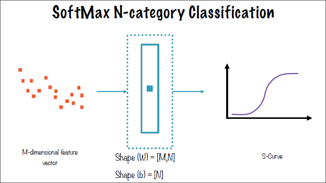

# Introduction

## Types of machine learning

### Classification

A classification ML-algorithm is one which determines if something belongs to one or more groups.

ML-based classifiers differ from traditional "rule-based" classifiers in that:

- ML-based classifiers are dynamic while rule-based classifiers are static.
- Rule-based classifiers require experts while ML-based classifiers do not.
- ML-based classifiers require a corpus of data while rule-based classifiers do not.

**Feature vectors** are the attributes that the ML algorithm focuses on. Each data point is a list, or vector, of features. In a traditional classifier, the experts determine which features to pay attention to.

<a name="neural-networks"></a>

### Neural networks

A neural network is a deep learning representation classification system. A deep learning system is one which decides it's feature vector in part or in whole independently. A deep learning-based binary classifier (seen in below image) requires a corupus of data, a feature selection & classification algorithm which contains multiple neural layers comprised of neurons. The neural layers which interact with the images directly (the Pixels and Object Parts layer which take in the image and output the image to the ML-based classifier in the example) are called visible layers, while the others are known as hidden layers.


The interaction of the individual neural layers and the neurons themselves can be seen in the following image.


The difficulty in designing a neural network is in choosing which features to map and how to architect and implement those designs.

The network contains complex interconnects between simple neurons. Different configurations lend themselves to different applications; for example a convolutional neural network would be used for image processing, while text or natural language processing applications would use a recurrent neural network. The difference between these are the interconnections between the neurons. The neurons themselves perform only two simple functions to its specific inputs: affine transformation (Wx+b) which is simply a weighted sum with a bias added, and activation function (ReLU, SoftMax, etc).


The values of W and b, which are variables, are determined by TensorFlow in the training process. The objective of the training process is to determine the optimal values of W and b for each neuron. This is accomplished using the cost function, the optimizer, and run for a set number of iterations, all which are specified by the developer. During the training process, outputs from the deeper layers must be fed back to the earlier layers to determine the optimal values, this is known as back propogation. The activation function, the second step of the neuron-level operation, allows neural networks to perform linear or non-linear transformations.

### Regression

Regression, or fitting a curve to a set of data points, is the simplest example of machine learning possible. Linear regression is the simplest form of regression.

The _error_ of regression is calculated by taking the sum of the squares of the residuals, or distance between the regression fit line and all of the data points.

In the LinearRegressionWithFakeData.ipynb example, the GradientDescentOptimizer library is used to solve the linear regression on a very simple data set to find the best fit line. Optimizer libraries provide simple, out of the box solutions to regression.

### Clustering

### Rule extraction

## Computation graph

A computation graph, is a directed, acyclic representation of a TensorFlow algorithm. The tensors, the arrows in the graph, flow strictly from left to right and are modified by the nodes within the graph.


The connections to the left of a node are known as the direct or indirect dependencies.


The result of the computation graph has the loss calculated, which is then fed back in to the neural network. This feedback loop can be visualized using either the neural network layered diagram:


or the computation graph via "unrolling" the graph:


Analysis of a computation graph for two distinct nodes, which contain no overlapping dependencies, can be parallelized and even distributed to multiple machines in a cluster or cloud computing application. This can be referred to as "lazy evaluation".

## Tensors

The rank of a tensor is an integer. A scalar, for example, is rank 0.

The two steps in a TensorFlow program are:

- building a graph
- running a graph

Tensors connect nodes in a computation graph. A tensor is the central unit of data in TensorFlow. A tensor consists of a set of primitive values shaped into an array of any number of dimensions.

Vectors, which are 1-Dimensional tensor, are defined with one set of square brackets: [1, 3, 5, 7, 9].
A matrix is a 2-Dimensional tensor, which is denoted by two sets of square brackets: [[1, 2], [2, 3][3, 4 ]].

### Rank of a tensor

The rank, therefore, can be thought of as the number of square brackets enclosing the set of numbers.

### Shape of a tensor

The shape of a tensor defines how many elements exist along a certain dimension. For example, the above matrix ([[1, 2], [2, 3][3, 4 ]]) has a shape of [2, 3] (three sets of pairs).

### Data type of a tensor

The final defining characteristic is the data type: int, float, bool, etc.

## Datatypes in TensorFlow

There are three data types for tensors in TensorFlow: Constants, placeholders, and variables.

### Constants

Constants are immutable values used for storing discrete values in TensorFlow.

### Placeholders

Due to the iterative approach of machine learning algorithms, placeholders are required for the input parameters to assume new values for the current iteration. For example, in the linear regression implementation, placeholders are used to take the values of the x and y coordinates for the data points for each iteration of the algorithm.


The placeholders in this computation graph are the input nodes A and B.

### Feed dictionary

For functions in TensorFlow to have a value for the dependent variable, values for the independent variable must be declared. This can be done using a `feed_dict` which is a json object which contains the values for the independent variable used in the operation.

```python
x = tf.placeholder(tf.int32, shape=[3], name='x')

sum_x = tf.reduce_sum(x, name="sum_x")

print "sum(x): ", sess.run(sum_x, feed_dict={x: [100, 200, 300]})
```

In this simple example, x is the placeholder which is defined as an integer array of 3 values. The sum of the array is computed using `session.run()` on the `tf.reduce_sum()` on the placeholder. The feed dictionary declares the values for the placeholder in the sum operation.

In summary, the dependent variable is instantiated as a `tf.placeholder()` and given discrete values for operations via a `feed_dict()`.

### Variables

While the placeholder assumes the value of the input, a variable is declared to hold the constantly changing value of the result. Variables in TensorFlow must be first instantiated by declaring

`y = tf.Variable([1.0, 3.0], tf.float32, name='y')` and then initialized using either the global initializer:

`tf.global_variables_initializer()`

or on a specific variable using:
`tf.variables_initializer([y])` methods before they can be accessed in a TensorFlow session.

# Working with TensorFlow

## Working with Images

In TensorFlow, working with images depends on using neural networks to perform image recognition. The pixels themselves, the fundamental building blocks of images, are converted to tensors using image recognition in the neural network algorithm.

Image recognition using neural networks is accomplished by feeding a corpus of images into a feature selection and classification algorithm, the output of which is an ML-based classifier (as discussed in [neural networks](#neural-networks)). This classifier can then be applied to a new image to produce a classification label. Machine learning is accomplished by first training a model, then using the corpus of images (the training data) to tweak and optimize the parameters in that model, and then you have the classifier which can be used on a new image.

## Images as Tensors

The individual pixels of an image, as described above, are converted to tensors which can be used in the TensorFlow application. Each pixel holds a value based on the type of image. For grayscale images, the pixel holds a value between 0-1 to describe the level of saturation of gray in that pixel. RGB (**R**ed, **G**reen, **B**lue) is another typical form of color encoding. For RGB encoding, three values are required to describe the color in each pixel. For pure red, the numerical representation in RGB encoding would be (255, 0, 0). Likewise, blue would be (0, 0 255) and green
(0, 255, 0). These values are also called **channels** which represent the color in a pixel.

Images can also be represented in 3-D tensors. The first two elements correspond to the pixel's x-and-y coordinate location, and the third element corresponds to the number of channels of color-encoding in the image.


In the above image, the left tensor is a grayscale image, whereas the right tensor representation is a 3-channel encoded image.

TensorFlow typically deals with 4-Dimensional shape vector representation of images, where the first value is the number of images in the list. For example, a list of 10 of the 6 pixel by 6 pixel images above with 3-channel color representation would have a shape vector of (10, 6, 6, 3) - 10 images, of 6 x 6 pixel size, and 3-channel color representation respectively.

### Multithreading

TensorFlow supports built-in multi-threading via the `tf.train.coordinator()` and `tf.train.start_queue_runners()` functions which handle the threads and dispatch resources as needed to complete the image rendering and manipulation.

Calling `tf.train.coordinator().request_stop()` and `tf.train.coordinator().request_stop()` will have the python interpretor wait for the tasks to complete before continuing.

### Compiling images into a list

Calling `tf.stack()` on an array of images will convert a list of 3-D tensors into a single 4-D tensor. For example, two-(224, 224, 3) tensors will become (2, 224, 224, 3) which is an array of two 224 pixel x 224 pixel, three-channel image tensors.

## MNIST & K-nearest-neighbor Algorithm

The Modified National Institute of Standards handwritten digit dataset, which is freely available for use [here](http://yann.lecun.com/exdb/mnist/index.html) contains 60,000 handwritten digits which we will analyze using the K-nearest-neighbor machine-learning algorithm. Each image is (28, 28, 1) and has a corresponding label containing the number in the image which can be used to optimize and improve our algorithm.

In general, there are two types of ML algorithms:

**Supervised** which uses labels associated with the training data to correct the algorithm, and **unsupervised** which requires robust set-up to learn the data as it does not use labels to self-correct.

The K-nearest-neighbor (KNN) algorithm is a supervised algorithm which uses the corpus of data to identify the closest image to the input. The algorithm accomplishes this using distance measures. Since the image as a tensor is simply a matrix of values, the distance between an input image and a training data image can be computed just like with regression. Euclidean, Hamming, and Manhattan distance measures are three examples of distance measures.


In the above example, the star represents the input image, and the various data points represent the training data images. The distance is computed between the input image and all data points in the training set. Based on this calculation, the algorithm will determine that the input image is a blue data point.

The L1 distance, also called the Manhattan distance, is the preferred method for dealing with distances in discrete space. This distance is found by counting the number of steps in each direction between two points.

One-hot notation is a vector which represents the value of the digit corresponding to the index of the vector. For example, a 4 would have a vector of [0, 0, 0, 0, 1, 0, 0, 0, 0, 0] in one-hot notation, the fourth index of the vector being 1, the one-hot index, while all other indeces are zero. By definition, this notation can only be used on discrete quantities.

For our MNIST comparison using the KNN algorithm, the 28 pixel x 28 pixel image tensors are flattened into vectors of length 784, which are then compared against the training data by summing the training data vector and the negation of the test data in 5,000-element chunks. This results in 5,000 vectors of length 784 containing the L1 distance between each pixel in the test image against the MNIST training data chunk. The sum of the absolute value of these vectors is then computed and reduced to a single-element vector per distance vector using `tf.abs()` and `tf.reduce_sum()`.

For K = 1, `numpy.argmin()` can be used to find the single nearest neighbor for our test image, then the label of the nearest neighbor from the training data can be used to compare against the test digit to perform the supervised optimization of the algorithm.

## Learning algorithms

A machine learning algorithm is one which is able to learn from data. "Learning" is defined as a computer program with respect to some class of tasks T, and performance measure P which improves with experience E. This performance measure could be accuracy in a classification algorithm, residual variance in regression, or a number of other metrics.

## Implementing Linear Regression

Linear regression can be implemented using a simple neural network of one neuron containing a linear activation function. The implementation of an ML-based regression algorithm is as follows:


An epoch is each iteration or step of the optimizer, and the batch size is the number of data points given to the optimizer for each epoch. Stochastic gradient descent optimizers use only one data point at a time, while mini-batch and batch gradient descent optimizers use a subset or the entirety of the data points, respectively, for each iteration. The goal of the optimizer is to minimize the cost function of the regression.

## Logistic Regression

Linear regression seeks to quantify effects given causes, while logistic regression seeks to quantify the probability of effects given causes. For this reason, logistic regression is also known as linear classification.

While similar, the uses of logistic regression vary, and the TensorFlow implementation is different from linear regression in two primary ways:

- logistic regression uses a softmax activation function, and
- cross-entropy as the cost function to minimize the mean-square error (MSE).

Logistic regression uses a probability function which results in an increasing probability for positive values of A and B, and a decreasing probability for negative values of A and B (per the below image)


[ ] TODO: update image with no cursor.

Logistic regression requires a categorical dependent or y-variable, and can use a continuous or categorical x-variable just like linear regression. Logistic regression seeks to fit the data to an S-curve by solving for the optimal values of the A and B variables. Logistic regression can be converted to a linear form by taking the log transformation of the probability equation. This is known as the logit equation, which is defined as the natural log of the odds function.

## Implementing Logistic Regression

Logistic regression varies from linear regression implementation in two primary ways as described above:

- softmax activation function
- and cross-entropy cost function

The number of neurons required to implement logistic regression in TensorFlow is the number of classification labels required minus one. So for binary classification, our labels are True and False, and as such this requires only one neuron to implement (2 - 1 = 1).


The left-hand side of the neuron-level image is identical to the linear regression neuron, with the activation function producing the probability equations as shown in the below image.


Generalizing, an M-length feature vector with N number of required classifications requires the W vector to be [M, N] and b to be [N].



The cross-entropy cost function for logistic regression can be visualized by imagining two sets of series data: one for the actual y-values (y_actual) and one for the predicted y-values (y_predicted). Superimposing these two series on the same axis results in either the labels of the two series being lined up as in the below image, or not lined up. The lined up, or in-synch labels result in a low cross-entropy, while out of synch labels result in a high cross entropy. Cross-entropy is a way to determine if two sets of numbers have been drawn from similar or different probability distributions.


For the logistic regression lab, we are utilizing the single neuron implementation of logistic regression in TensorFlow to determine the probability of Google stock having an increasing or decreasing return from one month to the next by classifying the returns of the S&P 500 index as our independent variable. We have used pandas and numpy in determining the baseline, and will compare that result to the ML-based logistic regression.

The softmax activation function is invoked using the following method in the `tf.nn` TensorFlow neural network library:

```python
tf.nn.softmax_cross_entropy_with_logits(labels=y_, logits=y))
```

`y_` is our placeholder for the output label of the softmax function (either True - 1 or False - 0) in One Hot notation. `y` is the output of the affine transformation, or the input to the softmax activation function `y=W*x + b`.

We use `tf.reduce_mean` on this softmax activation function to compute our cross-entropy calculation to compare the probability distributions of our predicted value against the actual value (Google stock increasing/decreasing versus S&P increasing/decreasing).

## Estimators in TensorFlow

Estimators are an API in TensorFlow which provide encapsulation of training, evaluating, predicting, and exporting your TensorFlow ML-algorithm. Estimators exchange data directly with the input function, which transmits data to and from the feature vector. The estimator then handles instantiating the optimizer, fetching the training data, defining the cost function, running the optimization, and finally returning a trained model.

## Neural Networks

### Neuronal Operations

A single neuron can be classified as active if a change in the input to that neuron results in a change in the output of the neuron. If any arbitrary change to an input does not cause a change in the output, it can be said to be dead or inactive. The output of one neuron is also the input to one or many neurons in a subsequent layer. The weights on an input to a neuron define how sensitive the neuron is to that particular input. The higher the weight of an input, the more sensitive that neuron is to the input. "Neurons that fire together wire together".

A neuron, as described before, contain an affine transformation and an activation function. Examples of common activation functions and their output graphs are shown in the below image.


The choice of activation function drives the design of a neural network. The combination of the affine transformation and activation function allow neural networks to learn arbitrarily complex algorithms.

Training via back propogation is a way to feed the error and output of the optimization algorithm backwards through the layers of the neural networks to tweak the weights and biases (variables W and b, respectively) in reverse sequential order to improve the accuracy of the neural network.


### Neural Network Automobile Prices Lab

For this lab we used a public dataset of automobiles from UCI as the training data to an ML-based predictor of automobile price given various categorical and numerical features from the dataset such as make, engine type, miles-per-gallon, etc. We created a pandas dataframe to read in and clean up the data and passed it into TensorFlow using `tf.estimator.inputs.pandas_input_fn()` which is a built-in method in TensorFlow which takes in a pandas data frame as an input. We defined `feature_columns` as an array of both categorical and numerical column data as unique entries for each column in the dataset. Scaling the price column to tens of thousands of dollars rather than the full price was used to improve accuracy as TensorFlow works better with smaller numbers. These scaled values were converted back to dollars after the training.

We tweaked the neural network configuration using the `hidden_units` parameter of the `tf.estimator.DNNRegressor()` method between a two-layer and a three-layer configuration to demonstrate the effectiveness of each on our resulting training model. The accuracy improved substantially when using a three-layer DNN (dense neural network) with the configuration of [24, 16, 24] neurons rather than the two-layer configuration of [20, 20] neurons.

### Hyperparameters

Hyperparameters in neural networks are design decisions made by the developer to improve the performance of a neural network model. Examples of these hyperparameters are: network topology (neuron interconnections), number of neural layers, number of neurons within each layer, and the activation function used in the neuronal operation. Hyperparameters are design decisions, or inputs, used in the actual model, whereas model parameters are the weights and biases determined during the training process. Additionally, model parameters are measured using validation datasets to find the best possible model, while hyperparameter tuning is used to generate the model which is used to validate the datasets.

### Problems with Neural Networks

Neural networks are prone to several problems which cause a model to fail to be able to perform its task effectively. One is vanishing gradient, which is the term used when the loss function fails to adjust between iterations. If the gradient, or result of the loss function does not change, the iterative process to determine W and b fails to optimize correctly and will converge to an inaccurate result. The converse of this is the exploding gradient problem where the gradient moves abruptly or explodes causing diverging solutions and an inaccurate model.

These issues can be dealt with using the following methods: proper initialization of W and b using a formula, gradient clipping to establish a range of acceptable values for the gradient to prevent the value from exploding in either direction, batch normalization to limit the output of the neuron to be centered around zero, and lastly using the proper, non-saturating activation function.

Initialization of the variables should be conducted such that the variance of the outputs in each direction is equal to the variance of inputs. By initializing W to a random value for each neuron, a normal distribution is acheived. The standard deviation is calculated based on the number of inputs and outputs. Gradient clipping is most often used during the back propagation with recurrent neural networks, which are prone to exploding and vanishing gradients. Batch normalization zero-centers the inputs before passing to the activation function. The mean is then subtracted from this and that sum is divided by the standard deviation. This method is effective enough to use a saturating activation function.

Saturation occurs when the output of the activation function plateaus or is unchanging. In the logit S-curve for example, the output in the center, where the slope is non-zero, is the active or responsive region, while the left and right-hand side of the curve, where the slope is zero, is the saturation region. In these regions, the neuron might become unresponsive - that is, the output of the neuron will not change as the input changes. If this continues throughout training, and the neuron cannot be moved out of the saturation region, the neuron is said to be dead.


The ReLU activation function also has a saturation region for small negative values. The ELU activation function, which has a small exponential value for the negative region, is the preferred method to dealing with the nonresponsive predisposition of the ReLU function.

### Overfitting and Underfitting

Overfitting the curve occurs when a model fits the training data too closely, but cannot accurately predict test data. This model is said to have low bias error, where few assumptions are made about the underlying data, but a high variance error, or high changes to the model with differing training data sets. An overfitted model is too complex, and too much importance is placed on the training data. The opposite is an underfitted model, which makes many assumptions about the training data, and does not change much when the training data is changed, and is too simple. Neural networks are prone to overfitting, and thus high variance. This is why it is important to test the model against a test set of data to determine the variance.

Preventing overfitting can be accomplished by _regularization_, which penalizes complex models; _cross-validation_ or having two datasets and distinct phases for training and validation; _dropout_, or intentionally turning off a subset of the neurons in the network, which causes other neurons to correspondingly adjust their output during training.

_Regularization_ is simple to accomplish with gradient descent optimizers by adding a penalty to the cost function which increases as the complexity of the model, or the function of the neuron weights, increases. This forces the optimizer to keep the model simple.

With _cross-validation_ comes hyperparameter tuning, and running training data through multiple models, choosing the model which most accurately predicts the test data.

"_Dropout_", which is deactivating a random subset of the the neurons within a NN, causes the neurons which remain on during a particular training phase to recognize patterns in the data using a different network configuration. This results in a more robust NN which is less prone to overfitting.

### Iris flower DNN Classifier Lab

For this lab, we are working with the iris data set. The objective of this ML model is to predict the label of the iris based on the features which are the Sepal length and width and petal length and width. Rather than using pandas for this lab, we are using TensorFlow to iterate over the .csv dataset by invoking `tf.decode_csv()` which extracts the header data from the .csv file. The features are created by zipping the feature names into a dictionary for each line in the iterator. We invoke `tf.data.TextLineDataset().map()` in our helper method `get_features_labels(filename, shuffle=False, repeat_count=1)` which allows for shuffling to randomize the order of the data, `repeat_count` allows for copying of the dataset, and we specify the `batch_size` as 32. We use the `dataset.make_one_shot_iterator()` method which iterates over the dataset exactly once.
