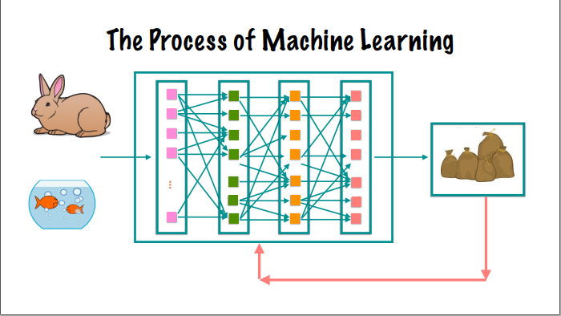
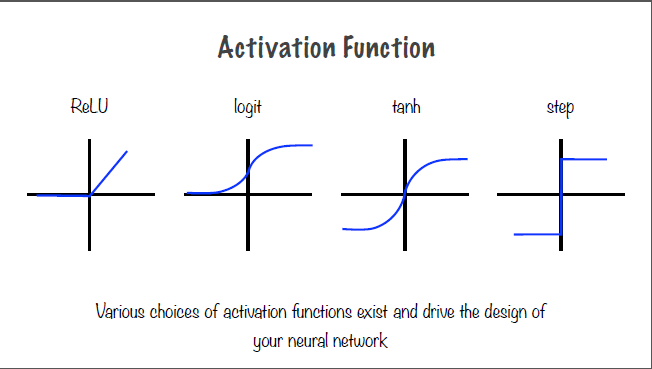

[_metadata_:author]: - "benlopata"
[_metadata_:style]: - "blopata.github.io/assets/css/darkdownstyle.css"
[_metadata_:tags]: - "python, tensorflow, tf, machine learning, ML"

<!-- vscode-markdown-toc -->

- I - [Introduction](#introduction)
  - [1. Main Types of machine learning](#1-main-types-of-machine-learning)
    - [1.1. Classification](#11-classification)
    - [1.2. Regression](#12-regression)
    - [1.3. Clustering](#13-clustering)
    - [1.4. Rule extraction](#14-rule-extraction)
  - [2. Neural networks](#2-neural-networks)
- II - [Introduction to TensorFlow](#introduction-to-tensorflow)
  - [3. Computation graph](#3-computation-graph)
  - [4. Tensors](#4-tensors)
    - [4.1. Rank of a tensor](#41-rank-of-a-tensor)
    - [4.2. Shape of a tensor](#42-shape-of-a-tensor)
    - [4.3. Data type of a tensor](#43-data-type-of-a-tensor)
  - [5. Datatypes in TensorFlow](#5-datatypes-in-tensorflow)
    - [5.1. Constants](#51-constants)
    - [5.2. Placeholders](#52-placeholders)
    - [5.3. Feed dictionary](#53-feed-dictionary)
    - [5.4. Variables](#54-variables)
- III - [Working with TensorFlow](#working-with-tensorflow)
  - [6. Multithreading](#6-multithreading)
  - [7. Working with Images](#7-working-with-images)
  - [8. Images as Tensors](#8-images-as-tensors)
    - [8.1. Compiling images into a list](#81-compiling-images-into-a-list)
- IV - [Learning algorithms](#9-learning-algorithms)
  - [10. MNIST & K-nearest-neighbor Algorithm](#10-mnist---k-nearest-neighbor-algorithm)
  - [11. Regression](#11-regression)
    - [11.1. Linear Regression](#111-linear-regression)
    - [11.2. Implementing Linear Regression](#112-implementing-linear-regression)
    - [11.3. Logistic Regression](#113-logistic-regression)
    - [11.4. Implementing Logistic Regression](#114-implementing-logistic-regression)
    - [11.5. Estimators in TensorFlow](#115-estimators-in-tensorflow)
  - [12. Neural Networks](#12-neural-networks)
    - [12.1. Neuronal Operations](#121-neuronal-operations)
    - [12.2. Hyperparameters](#122-hyperparameters)
    - [12.3. Problems with Neural Networks](#123-problems-with-neural-networks)
    - [12.4. Overfitting and Underfitting](#124-overfitting-and-underfitting)
    - [12.5. Prediction Accuracy](#125-prediction-accuracy)
    - [12.6. Decision Threshold](#126-decision-threshold)
    - [12.7. Choosing Model Characteristics](#127-choosing-model-characteristics)
  - [13. Convolutional Neural Networks](#13-convolutional-neural-networks)
    - [13.1. Convolution](#131-convolution)
    - [13.2. Design Features of CNNs](#132-design-features-of-cnns)
    - [13.3. CNNs versus DNNs](#133-cnns-versus-dnns)
    - [13.4. Feature Maps](#134-feature-maps)
    - [13.5. Pooling Layers](#135-pooling-layers)
    - [13.6. CNN Architectures](#136-cnn-architectures)
  - [14. Recurrent Neural Networks](#14-recurrent-neural-networks)
    - [14.1. Recurrent Neurons](#141-recurrent-neurons)
    - [14.2. Recurrent vs Normal Neuron](#142-recurrent-vs-normal-neuron)
    - [14.3. Training an RNN](#143-training-an-rnn)
    - [14.4. Long Memory Neurons](#144-long-memory-neurons)
    - [14.5. Text as Sequential Data](#145-text-as-sequential-data)
  - [15. Supervised and Unsupervised Learning](#15-supervised-and-unsupervised-learning)
    - [15.1. Clustering Algorithms](#151-clustering-algorithms)
    - [15.2. K-Means Clustering](#152-k-means-clustering)
    - [15.3. Hyperparameters](#153-hyperparameters-1)
  - [16. Autoencoders and Principal Components Analysis](#16-autoencoders-and-principal-components-analysis)
    - [16.1. Autoencoders Neural Network Architecture](#161-autoencoders-neural-network-architecture)
    - [16.2. Stacked Autoencoders](#162-stacked-autoencoders)
    - [16.3. Denoising Autoencoders](#163-denoising-autoencoders)
- V - [Labs](#labs)
  - [17. Logistic Regression](#17-logistic-regression)
  - [18. MNIST & KNN](#18-mnist---knn)
  - [19. Neural Network Automobile Prices](#19-neural-network-automobile-prices)
  - [20. Iris flower DNN Classifier](#20-iris-flower-dnn-classifier)
  - [21. Convolution Neural Network](#21-convolution-neural-network)
  - [22. Building a CNN Using Estimator API](#22-building-a-cnn-using-estimator-api)
  - [23. RNNs for Image Classification](#23-rnns-for-image-classification)
  - [24. Sentiment Analysis Using RNNs](#24-sentiment-analysis-using-rnns)
  - [25. K-Means Clustering with 2-D points](#25-k-means-clustering-with-2-d-points)
  - [26. K-Means Clustering with Images](#26-k-means-clustering-with-images)
  - [27. Principal Component Analysis](#27-principal-component-analysis)
  - [28. Stacked Autoencoder Lab](#28-stacked-autoencoder-lab)
  - [29. GCP Taxicab Prediction Lab](#29-gcp-taxicab-prediction-lab)
    - [29.1. _Data cleaning and exploring_](#291-data-cleaning-and-exploring-)
    - [29.2. _Taxi Cab TensorFlow Model_](#292-taxi-cab-tensorflow-model-)
    - [29.3. Refactoring the Input](#293-refactoring-the-input)

<!-- vscode-markdown-toc-config
	numbering=true
	autoSave=true
	/vscode-markdown-toc-config -->
<!-- /vscode-markdown-toc -->

# Introduction

## 1. Main Types of machine learning

### 1.1. Classification

A classification ML-algorithm is one which determines if something belongs to one or more groups.

ML-based classifiers differ from traditional "rule-based" classifiers in that:

- ML-based classifiers are dynamic while rule-based classifiers are static.
- Rule-based classifiers require experts while ML-based classifiers do not.
- ML-based classifiers require a corpus of data while rule-based classifiers do not.

**Feature vectors** are the attributes that the ML algorithm focuses on. Each data point is a list, or vector, of features. In a traditional classifier, the experts determine which features to pay attention to.

### 1.2. Regression

Regression, or fitting a curve to a set of data points, is the simplest example of machine learning possible. Linear regression is the simplest form of regression.

The _error_ of regression is calculated by taking the sum of the squares of the residuals, or distance between the regression fit line and all of the data points.

In the LinearRegressionWithFakeData.ipynb example, the GradientDescentOptimizer library is used to solve the linear regression on a very simple data set to find the best fit line. Optimizer libraries provide simple, out of the box solutions to regression.

### 1.3. Clustering

Clustering is looking at the input data and trying to find logical grouping within the data.

### 1.4. Rule extraction

Determining implicit rules, or correlational relationships, within the input data.

## 2. Neural networks

A neural network is a deep learning representation classification system. A deep learning system is one which decides it's feature vector in part or in whole independently. A deep learning-based binary classifier (seen in below image) requires a corupus of data, a feature selection & classification algorithm which contains multiple neural layers comprised of neurons. The neural layers which interact with the images directly (the Pixels and Object Parts layer which take in the image and output the image to the ML-based classifier in the example) are called visible layers, while the others are known as hidden layers.


The interaction of the individual neural layers and the neurons themselves can be seen in the following image.


The difficulty in designing a neural network is in choosing which features to map and how to architect and implement those designs.

The network contains complex interconnects between simple neurons. Different configurations lend themselves to different applications; for example a convolutional neural network would be used for image processing, while text or natural language processing applications would use a recurrent neural network. The difference between these are the interconnections between the neurons. The neurons themselves perform only two simple functions to its specific inputs: affine transformation (Wx+b) which is simply a weighted sum with a bias added, and activation function (ReLU, SoftMax, etc).


The values of W and b, which are variables, are determined by TensorFlow in the training process. The objective of the training process is to determine the optimal values of W and b for each neuron. This is accomplished using the cost function, the optimizer, and run for a set number of iterations, all which are specified by the developer. During the training process, outputs from the deeper layers must be fed back to the earlier layers to determine the optimal values, this is known as back propogation. The activation function, the second step of the neuron-level operation, allows neural networks to perform linear or non-linear transformations.

# Introduction to TensorFlow

## 3. Computation graph

A computation graph, is a directed, acyclic representation of a TensorFlow algorithm. The tensors, the arrows in the graph, flow strictly from left to right and are modified by the nodes within the graph.


The connections to the left of a node are known as the direct or indirect dependencies.


The result of the computation graph has the loss calculated, which is then fed back in to the neural network. This feedback loop can be visualized using either the neural network layered diagram:



or the computation graph via "unrolling" the graph:


Analysis of a computation graph for two distinct nodes, which contain no overlapping dependencies, can be parallelized and even distributed to multiple machines in a cluster or cloud computing application. This can be referred to as "lazy evaluation".

## 4. Tensors

The "rank", also "order", of a tensor defines it's dimensionality. The order is a zero-indexed integer value, thus a scalar value is a tensor of rank 0.

Tensors connect nodes in a computation graph. A tensor is the central unit of data in TensorFlow. A tensor consists of a set of primitive values shaped into an array of any number of dimensions.

Vectors, which are 1-Dimensional tensor, are defined with one set of square brackets: [1, 3, 5, 7, 9].
A matrix is a 2-Dimensional tensor, which is denoted by two sets of square brackets: [[1, 2], [2, 3][3, 4 ]].

### 4.1. Rank of a tensor

The rank, therefore, can be thought of as the number of square brackets enclosing the set of numbers.

### 4.2. Shape of a tensor

The shape of a tensor defines how many elements exist along a certain dimension. For example, the above matrix ([[1, 2], [2, 3][3, 4 ]]) has a shape of [2, 3] (three sets of pairs).

### 4.3. Data type of a tensor

The final defining characteristic is the data type: int, float, bool, etc.

## 5. Datatypes in TensorFlow

There are three data types for tensors in TensorFlow: Constants, placeholders, and variables.

### 5.1. Constants

Constants are immutable values used for storing discrete values in TensorFlow.

### 5.2. Placeholders

Due to the iterative approach of machine learning algorithms, placeholders are required for the input parameters to assume new values for the current iteration. For example, in the linear regression implementation, placeholders are used to take the values of the x and y coordinates for the data points for each iteration of the algorithm.


The placeholders in this computation graph are the input nodes A and B.

### 5.3. Feed dictionary

For functions in TensorFlow to have a value for the dependent variable, values for the independent variable must be declared. This can be done using a `feed_dict` which is a json object which contains the values for the independent variable used in the operation.

```python
x = tf.placeholder(tf.int32, shape=[3], name='x')

sum_x = tf.reduce_sum(x, name="sum_x")

print "sum(x): ", sess.run(sum_x, feed_dict={x: [100, 200, 300]})
```

In this simple example, x is the placeholder which is defined as an integer array of 3 values. The sum of the array is computed using `session.run()` on the `tf.reduce_sum()` on the placeholder. The feed dictionary declares the values for the placeholder in the sum operation.

In summary, the dependent variable is instantiated as a `tf.placeholder()` and given discrete values for operations via a `feed_dict()`.

### 5.4. Variables

While the placeholder assumes the value of the input, a variable is declared to hold the constantly changing value of the result. Variables in TensorFlow must be first instantiated by declaring

`y = tf.Variable([1.0, 3.0], tf.float32, name='y')` and then initialized using either the global initializer:

`tf.global_variables_initializer()`

or on a specific variable using:
`tf.variables_initializer([y])` methods before they can be accessed in a TensorFlow session.

# Working with TensorFlow

## 6. Multithreading

TensorFlow supports built-in multi-threading via the `tf.train.coordinator()` and `tf.train.start_queue_runners()` functions which handle the threads and dispatch resources as needed to complete the image rendering and manipulation.

Calling `tf.train.coordinator().request_stop()` and `tf.train.coordinator().request_stop()` will have the python interpretor wait for the tasks to complete before continuing.

## 7. Working with Images

In TensorFlow, working with images depends on using neural networks to perform image recognition. The pixels themselves, the fundamental building blocks of images, are converted to tensors using image recognition in the neural network algorithm.

Image recognition using neural networks is accomplished by feeding a corpus of images into a feature selection and classification algorithm, the output of which is an ML-based classifier (as discussed in [neural networks](#neural-networks)). This classifier can then be applied to a new image to produce a classification label. Machine learning is accomplished by first training a model, then using the corpus of images (the training data) to tweak and optimize the parameters in that model, and then you have the classifier which can be used on a new image.

## 8. Images as Tensors

The individual pixels of an image, as described above, are converted to tensors which can be used in the TensorFlow application. Each pixel holds a value based on the type of image. For grayscale images, the pixel holds a value between 0-1 to describe the level of saturation of gray in that pixel. RGB (**R**ed, **G**reen, **B**lue) is another typical form of color encoding. For RGB encoding, three values are required to describe the color in each pixel. For pure red, the numerical representation in RGB encoding would be (255, 0, 0). Likewise, blue would be (0, 0 255) and green
(0, 255, 0). These values are also called **channels** which represent the color in a pixel.

Images can also be represented in 3-D tensors. The first two elements correspond to the pixel's x-and-y coordinate location, and the third element corresponds to the number of channels of color-encoding in the image.


In the above image, the left tensor is a grayscale image, whereas the right tensor representation is a 3-channel encoded image.

TensorFlow typically deals with 4-Dimensional shape vector representation of images, where the first value is the number of images in the list. For example, a list of 10 of the 6 pixel by 6 pixel images above with 3-channel color representation would have a shape vector of (10, 6, 6, 3) - 10 images, of 6 x 6 pixel size, and 3-channel color representation respectively.

### 8.1. Compiling images into a list

Calling `tf.stack()` on an array of images will convert a list of 3-D tensors into a single 4-D tensor. For example, two-(224, 224, 3) tensors will become (2, 224, 224, 3) which is an array of two 224 pixel x 224 pixel, three-channel image tensors.

# Learning algorithms

A machine learning algorithm is one which is able to learn from data. "Learning" is defined as a computer program with respect to some class of tasks T, and performance measure P which improves with experience E. This performance measure could be accuracy in a classification algorithm, residual variance in regression, or a number of other metrics.

## 10. MNIST & K-nearest-neighbor Algorithm

The Modified National Institute of Standards handwritten digit dataset, which is freely available for use [here](http://yann.lecun.com/exdb/mnist/index.html) contains 60,000 handwritten digits which we will analyze using the K-nearest-neighbor machine-learning algorithm. Each image is (28, 28, 1) and has a corresponding label containing the number in the image which can be used to optimize and improve our algorithm.

In general, there are two types of ML algorithms:

**Supervised** which uses labels associated with the training data to correct the algorithm, and **unsupervised** which requires robust set-up to learn the data as it does not use labels to self-correct.

The K-nearest-neighbor (KNN) algorithm is a supervised algorithm which uses the corpus of data to identify the closest image to the input. The algorithm accomplishes this using distance measures. Since the image as a tensor is simply a matrix of values, the distance between an input image and a training data image can be computed just like with regression. Euclidean, Hamming, and Manhattan distance measures are three examples of distance measures.


In the above example, the star represents the input image, and the various data points represent the training data images. The distance is computed between the input image and all data points in the training set. Based on this calculation, the algorithm will determine that the input image is a blue data point.

The L1 distance, also called the Manhattan distance, is the preferred method for dealing with distances in discrete space. This distance is found by counting the number of steps in each direction between two points.

One-hot notation is a vector which represents the value of the digit corresponding to the index of the vector. For example, a 4 would have a vector of [0, 0, 0, 0, 1, 0, 0, 0, 0, 0] in one-hot notation, the fourth index of the vector being 1, the one-hot index, while all other indeces are zero. By definition, this notation can only be used on discrete quantities.

## 11. Regression

### 11.1. Linear Regression

Linear regression is the simplest form of regression which is an approach to linearly model the relationship between a dependent variable and one or more independent variables.

### 11.2. Implementing Linear Regression

Linear regression can be implemented using a simple neural network of one neuron containing a linear activation function. The implementation of an ML-based regression algorithm is as follows:

1. Develop a baseline using rudimentary methods and simple math.
2. Develop a computation graph which can be as simple as one single neuron as the affine transformation can sufficiently describe the relationship.
3. Develop a cost function, such as mean square error (MSE)
   to quyantify the fit of the model to the data.
4. Implement an optimizer, such as gradient descent optimizer to minimize the cost function.
5. Train the optimizer using input data in epochs.
6. End with a trained and converged model which has values of W and b to compare against the baseline.

An **epoch** is each iteration or step of the optimizer, and the batch size is the number of data points given to the optimizer for each epoch. Stochastic gradient descent optimizers use only one data point at a time, while mini-batch and batch gradient descent optimizers use a subset or the entirety of the data points, respectively, for each iteration. The goal of the optimizer is to minimize the cost function of the regression.

### 11.3. Logistic Regression

Linear regression seeks to quantify effects given causes, while logistic regression seeks to quantify the probability of effects given causes. For this reason, logistic regression is also known as linear classification.

While similar, the uses of logistic regression vary, and the TensorFlow implementation is different from linear regression in two primary ways:

- logistic regression uses a softmax activation function, and
- cross-entropy as the cost function to minimize the mean-square error (MSE).

Logistic regression uses a probability function which results in an increasing probability for positive values of A and B, and a decreasing probability for negative values of A and B (per the below image)


Logistic regression requires a categorical dependent or y-variable, and can use a continuous or categorical x-variable just like linear regression. Logistic regression seeks to fit the data to an S-curve by solving for the optimal values of the A and B variables. Logistic regression can be converted to a linear form by taking the log transformation of the probability equation. This is known as the logit equation, which is defined as the natural log of the odds function.

### 11.4. Implementing Logistic Regression

Logistic regression varies from linear regression implementation in two primary ways as described above:

- softmax activation function
- and cross-entropy cost function

The number of neurons required to implement logistic regression in TensorFlow is the number of classification labels required minus one. So for binary classification, our labels are True and False, and as such this requires only one neuron to implement (2 - 1 = 1).


The left-hand side of the neuron-level image is identical to the linear regression neuron, with the activation function producing the probability equations as shown in the below image.


Generalizing, an M-length feature vector with N number of required classifications requires the W vector to be [M, N] and b to be [N].


The cross-entropy cost function for logistic regression can be visualized by imagining two sets of series data: one for the actual y-values (y_actual) and one for the predicted y-values (y_predicted). Superimposing these two series on the same axis results in either the labels of the two series being lined up as in the below image, or not lined up. The lined up, or in-synch labels result in a low cross-entropy, while out of synch labels result in a high cross entropy. Cross-entropy is a way to determine if two sets of numbers have been drawn from similar or different probability distributions.


### 11.5. Estimators in TensorFlow

Estimators are an API in TensorFlow which provide encapsulation of training, evaluating, predicting, and exporting your TensorFlow ML-algorithm. Estimators exchange data directly with the input function, which transmits data to and from the feature vector. The estimator then handles instantiating the optimizer, fetching the training data, defining the cost function, running the optimization, and finally returning a trained model.

## 12. Neural Networks

### 12.1. Neuronal Operations

A single neuron can be classified as active if a change in the input to that neuron results in a change in the output of the neuron. If any arbitrary change to an input does not cause a change in the output, it can be said to be dead or inactive. The output of one neuron is also the input to one or many neurons in a subsequent layer. The weights on an input to a neuron define how sensitive the neuron is to that particular input. The higher the weight of an input, the more sensitive that neuron is to the input. "Neurons that fire together wire together".

A neuron, as described before, contain an affine transformation and an activation function. Examples of common activation functions and their output graphs are shown in the below image.



The choice of activation function drives the design of a neural network. The combination of the affine transformation and activation function allow neural networks to learn arbitrarily complex algorithms.

Training via back propogation is a way to feed the error and output of the optimization algorithm backwards through the layers of the neural networks to tweak the weights and biases (variables W and b, respectively) in reverse sequential order to improve the accuracy of the neural network.


### 12.2. Hyperparameters

Hyperparameters in neural networks are design decisions made by the developer to improve the performance of a neural network model. Examples of these hyperparameters are: network topology (neuron interconnections), number of neural layers, number of neurons within each layer, and the activation function used in the neuronal operation. Hyperparameters are design decisions, or inputs, used in the actual model, whereas model parameters are the weights and biases determined during the training process. Additionally, model parameters are measured using validation datasets to find the best possible model, while hyperparameter tuning is used to generate the model which is used to validate the datasets.

### 12.3. Problems with Neural Networks

Neural networks are prone to several problems which cause a model to fail to be able to perform its task effectively. One is vanishing gradient, which is the term used when the loss function fails to adjust between iterations. If the gradient, or result of the loss function does not change, the iterative process to determine W and b fails to optimize correctly and will converge to an inaccurate result. The converse of this is the exploding gradient problem where the gradient moves abruptly or explodes causing diverging solutions and an inaccurate model.

These issues can be dealt with using the following methods: proper initialization of W and b using a formula, gradient clipping to establish a range of acceptable values for the gradient to prevent the value from exploding in either direction, batch normalization to limit the output of the neuron to be centered around zero, and lastly using the proper, non-saturating activation function.

Initialization of the variables should be conducted such that the variance of the outputs in each direction is equal to the variance of inputs. By initializing W to a random value for each neuron, a normal distribution is acheived. The standard deviation is calculated based on the number of inputs and outputs. Gradient clipping is most often used during the back propagation with recurrent neural networks, which are prone to exploding and vanishing gradients. Batch normalization zero-centers the inputs before passing to the activation function. The mean is then subtracted from this and that sum is divided by the standard deviation. This method is effective enough to use a saturating activation function.

Saturation occurs when the output of the activation function plateaus or is unchanging. In the logit S-curve for example, the output in the center, where the slope is non-zero, is the active or responsive region, while the left and right-hand side of the curve, where the slope is zero, is the saturation region. In these regions, the neuron might become unresponsive - that is, the output of the neuron will not change as the input changes. If this continues throughout training, and the neuron cannot be moved out of the saturation region, the neuron is said to be dead.


The ReLU activation function also has a saturation region for small negative values. The ELU activation function, which has a small exponential value for the negative region, is the preferred method to dealing with the nonresponsive predisposition of the ReLU function.

### 12.4. Overfitting and Underfitting

Overfitting the curve occurs when a model fits the training data too closely, but cannot accurately predict test data. This model is said to have low bias error, where few assumptions are made about the underlying data, but a high variance error, or high changes to the model with differing training data sets. An overfitted model is too complex, and too much importance is placed on the training data. The opposite is an underfitted model, which makes many assumptions about the training data, and does not change much when the training data is changed, and is too simple. Neural networks are prone to overfitting, and thus high variance. This is why it is important to test the model against a test set of data to determine the variance.

Preventing overfitting can be accomplished by _regularization_, which penalizes complex models; _cross-validation_ or having two datasets and distinct phases for training and validation; _dropout_, or intentionally turning off a subset of the neurons in the network, which causes other neurons to correspondingly adjust their output during training.

_Regularization_ is simple to accomplish with gradient descent optimizers by adding a penalty to the cost function which increases as the complexity of the model, or the function of the neuron weights, increases. This forces the optimizer to keep the model simple.

With _cross-validation_ comes hyperparameter tuning, and running training data through multiple models, choosing the model which most accurately predicts the test data.

"_Dropout_", which is deactivating a random subset of the the neurons within a NN, causes the neurons which remain on during a particular training phase to recognize patterns in the data using a different network configuration. This results in a more robust NN which is less prone to overfitting.

### 12.5. Prediction Accuracy

Prediction accuracy is the primary metric for validating the efficacy of a ML-algorithm. Accuracy itself, however, is ineffective when dealing with a _skewed dataset_, that is one where certain labels are far more or far less common than other labels. Accuracy can be computed by dividing the sum of the true positive and negative results (that is, where the predicted label = actual label) divided by the total number of predictions.

Precision, which can be thought of as a measure of exactness or quality, is computed by dividing the true positive (predictied label = actual label) by the sum total number of positives (true and false).

Recall, which is the measure of completeness or quantity, can be computed by accuracy of the prediction label versus the total number of "true" labels for a binary classifier (true positive and false negative).


Stated differently,

Accuracy = (TP + TN) / (Total #)

Precision = TP / (TP + FP)

Recall = TP / (TP + FN)

### 12.6. Decision Threshold

The decision threshold is the point on a logistic curve at which the model predicts one label for probabilities lower than the threshold and the other label for probabilities higher than the threshold (for binary classifiers). This can also be thought of as an s-curve with Precision on the y-axis and conservativeness on the x-axis. As conservativeness increases, so too does prediction. However, a model which is too precise is also too constrained to provide accurate results; for instance, a decision threshold of 1 - or 100% - will result in only negative results. On the other hand, a model which is too liberal in predicting positive results, having too low of a decision threshold, results in an all positive result set but very low precision.

Plotting recall versus conservativeness results in a reciprocal graph to Precision versus Conservativeness graph. Thus, a model which has high recall has low precision, and a model with high precision has low recall.


### 12.7. Choosing Model Characteristics

How then are we to choose a model which can maximize true results without making the negative results too common?

Two heuristics for determining the effectiveness of the model are the F1 score and the ROC.

F1 Score - the harmonic mean of precision and recall - can be computed by the following formula:

F1 = 2 X (Precision X Recall) / (Precision + Recall)

The F1 score will be closer to the lower of recall and precision and favors an even tradeoff between recall and precision. Determining the optimal values is done with an iterative process similar to hyperparameter tuning. First you tweak the threshold values before computing the precision, recall, and the F1 score of the model. The higher the F1 score, the better the model is graded.

ROC curve - or receiver operator characteristic - is a plot of the true positive rate versus the false positive rate. The ideal model has a very high TP rate, and a FP rate of zero. The ROC curve can be computed by tweaking the threshold value iteratively and computing the True Positive (TP) rate and False Positive (FP) rate, and choosing the point at the top-left of the curve.

## 13. Convolutional Neural Networks

The convolutional neural network is ideal for processing images. A convolutional neural network is based on the visual cortex in humans. The neurons in our own brain respond to stimuli wihin it's own local receptive field, and disregard everything outside of that. These stimulated responses are then aggregated by other neurons to form patterns. For image processing in a neural network, the lower-level layers focus on larger scale details within the image, and higher-level layers focus on progressively more granular details. Within convolutional neural networks (CNNs) there are two basic types of layers: _convolution_ layers, which respond to stimuli in the local receptive field, and _pooling_, which subsamples the inputs to previous layers.

### 13.1. Convolution

The most important part of a CNN are the convolution layers as the local receptive field stimuli and response are the building blocks of CNNs. Convolution can be thought of as a sliding window function applied to a matrix. For image processing, the matrix is a 2-D matrix and the function is a filter or kernel function. For a simple 6x6 matrix, we choose a 3x3 kernel as a design decision when choosing a CNN. The kernel, which can be seen in the center of the diagram below, is then overlaid with the matrix and slid sequentially from the top-left, n number of spaces left and down as chosen by the algorithm design. The sum of the unfiltered values for each step, which correlate to the local receptive field, are then represented in a 4x4 convolution matrix (right-side of the diagram).


[The choice of the kernel function](http://aishack.in/tutorials/image-convolution-examples) depends on the application. For example, if the goal is to acheive a blurring effect, a kernel function which averages neighboring pixels would be chosen to acheive that effect. Kernel functions can be designed to acheive many complex image effects, such as edge and line detection.

### 13.2. Design Features of CNNs

_Zero padding_, adding a certain number of rows and columns of zeroes to the edges of your data, is used in order to have every element represented in the filtered result. Without zero padding, some elements will not be represented in the convolution matrix. Zero padding can also be used to acheive _wide-convolution_ which is when a convolution matrix is larger than the input matrix.

_Stride size_ is the number of rows to skip when moving horizontally and columns to move when moving vertically when sliding the kernel function. This determines how much of the local receptive field which will overlap when performing convolution. The lower the stride size, the greater the overlap.

### 13.3. CNNs versus DNNs

Dense neural networks, those which have an interconnection between each neuron of one layer with all neurons of a previous layer, have far too much complexity to be used effectively in image processing. For a 100 pixel by 100 pixel image, you would need 10,000 neurons in the first layer. With a dense neural network, this results in millions of interconnections by the second layer - millions of parameters to tune during training! CNNs, by way of the use of local receptive fields, have dramatically fewer parameters versus DNNs since they focus on only a small area within the image rather than trying to determine patters for every part of the image at once. CNNs also identify patterns independent of location whereas DNNs will inherently parse location information as well as image data due to their architecture.

### 13.4. Feature Maps

Convolutional layers are comprised of feature maps, which are themselves comprised of a number of neurons, each having received values based on the values of the local receptive field of the kernel function from the previous layer. Because the feature map is created from the same kernel function, all neurons within each feature map have the same weights and biases. CNNs are sparse neural networks since there is not a 1:1 correlation between neurons in two adjacent layers.

Each neuron's receptive field includes all the feature maps of all previous layers. In this way, aggregated features are processed in convolutional layers. For a visualization of how CNNs are constructed, see the image below. Many feature maps comprise a convolutional layer, and many convolutional (and pooling layers) comprise a single CNN.


### 13.5. Pooling Layers

Pooling layers subsample inputs into convolution layers. The neurons in a pooling layer have no associated weights or biases. A pooling layer neuron simply applies an aggregate function to all inputs. Pooling layers greatly reduce time and memory usage during training by reducing the numbers of parameters via aggregation and also mitigate overfitting to test data via subsampling. Pooling layers also allow NN to recognize features indpendent of location. Pooling is typically done on each channel independently.

### 13.6. CNN Architectures

CNNs are typically comprised of alternating convolutional and pooling layers. The output of each of the convolutional and pooling layers is an image, and the images shrink in size successively due to the subsampling done in the pooling layers. Each successive output image is also deeper due to the feature maps in the convolutional layer. The output of the entire set of these convolutional and pooling layers is then fed into a regular, feed-forward dense neural network which has a few, fully-connected layers each with a ReLU activation function and finally a SoftMax prediction layer to provide classification. For digit classification, there are 10 prediction labels, for image classification there can be more or fewer prediction labels.

## 14. Recurrent Neural Networks

### 14.1. Recurrent Neurons

Recurrent Neural Networks (RNNs) are based upon a recurrent neuron, that is a neuron which has memory or state. Unlike normal neural networks or convolutional neural networks the output of a recurrent neuron is fed back in as an input to the same neuron. This feedback makes RNNs well-suited for time series data. RNNs are known as auto-regressive because the output at time `t` is dependent on the output at time `t-1`.


### 14.2. Recurrent vs Normal Neuron

For a regular neuron, the input is a vector which produces a scalar output. However, a recurrent neuron with an input feature vector of [X<sub>0</sub>, X<sub>1</sub>, ..., X<sub>t</sub>] would produce an output vector of [Y<sub>0</sub>, Y<sub>1</sub>, ..., Y<sub>t</sub>]. Additionally, while a regular neuron has one weight vector, a recurrent neuron will have two: W<sub>y</sub> for the previous y-input, and W<sub>x</sub> for the indpendent x-input.

As recurrent neurons primarily deal with time-series data, it can be useful to think about the neuron for each instance of time for a given set. One way to visualize this is through "unrolling" the recurrent neuron through time. That is, showing the neurons inputs and outputs as plotted along a time axis. In the below image, notice how the output of the neuron at t=0 feeds into the input of the same neuron at t=1.


A layer within an RNN is generally a group of recurrent neurons, known as a RNN or memory cell. The same process for unrolling through time is performed on this memory cell for as many time instances as there are datapoints.

### 14.3. Training an RNN

Gradient descent optimizers, which seek to minimize the mean square error (MSE) for values of W and b, are used in RNNs as well. However, training of RNNs is accomplished through back-propagation through time (BPTT). BPTT is very similar to back-propagation, however BPTT has a few more details to consider as we unroll the RNN through time. The number of layers needed for an RNN depends on the number of time periods you wish to study. Because RNNs can be unrolled very far back in time, RNNs which rely upon time periods in the very distant past are especially prone to vanishing and exploding gradients as the gradient needs to be propagated back through each time instance.

One option to mitigate vanishing and exploding gradients in RNNs is to use truncated BPTT. Truncated BPTT uses only a subset of data points for time periods in the very distant past which can reduce the accuracy of the model. Another option is to use long short-term memory (LTSM) cells. LTSM cells were developed specifically to deal with vanishing and exploding gradients.

### 14.4. Long Memory Neurons

In order to combat the problems with vanishing and exploding gradients in deep recurrent neural networks, the state of a memory cell must be expanded to include long-term state. Long memory neurons, neurons that hold additional state for the distant past, have several advantages over recurrent neurons. In training, the gradients converge more easily and can be propagated faster through the layers leading to a convergent model more quickly. And for long memory neurons in prediction, the advantages are in not requiring truncating of inputs during the BPTT. Truncated BPTT can vastly decrease prediction performance as the output may be dependent upon the longer-term inputs which are removed by truncated BPTT.

A long/short-term memory cell (LSTM) has several additional components over and above a basic RNN cell. The inputs to an LSTM cell are the basic input, X<sub>t</sub>, the short-term memory value, C<sub>t-1</sub>, and the long-term memory value, h<sub>t-1</sub>. Within the memory cell are components which choose which old memories are important and which should be forgotten, update short and long-term state, as well as calculate the output y<sub>t<sub>.


These components are acheived using four distinct and fully-connected neural networks within the LSTM: the forget gate NN, the main NN, the input gate NN, and the output gate NN. Gates perform element-wise multiplication of two vectors. The forget gate looks at long-term memory and determines which memories from long-term memory should be included and which should be forgotten. The main gate works similarly to a basic RNN memory cell, with the distinction of storing a part of its output in long-term memory. The input and output gates determine which part of the long-term state should be included in the long-term memory and long-term state, respectively. In addition to these neural networks, the LSTM also has gate controllers which have logic for when to turn on all of these gates.


Some variants of LSTM cells are peephole connections, which are LSTM cells that store state for more than one period, and Gated Recurrent Unit (GRU) which are a simplified LSTM which stores only one state vector for both long and short-term memory. GRUs have fewer internal gates and NNs and acheive better performance over a basic LSTM cell.

### 14.5. Text as Sequential Data

RNNs are the ideal network for dealing with text data whether it be prediction such as autocompleting a sentence, language translation, or text classification which can also be called natural language processing or sentiment analysis. RNNs are ideal for dealing with sequential data, but then the question is How can one represent text as sequential data in a meaningful manner. First we view the text document as an ordered sequence of words. Each individual word must be encoded as a number. To accomplish this, there are a number of text embeddings available: one-hot notation, text frequency inverse-document frequency (TF-IDF), and the most popular method word embeddings.

**One-hot notation** for text documents is performed by creating a set of all words across the corpus of data. Then each document in the dataset is checked against the corpus for each word. If the word exists in the document, then it receives a 1 for that word, if the word does not exist, it receives a 0. A feature vector comprised of occurances of each word is constructed. The length of the feature vectors is the length of the corpus, and the feature vector is used as an input to the neural network. Distances can be computed between any two feature vectors using simple geometry which will group similar documents together. One-hot notation has several drawbacks: for large datasets, the feature vectors become enormous and increase processing time substantially; also the order is lost when using one-hot notation as a cypher does not exist; also valuable information, such as frequency of occurances, is lost.

**TF-IDF** tries to capture each words significance with respect to the document as well as the entire corpus of data. The value itself is calculated by multiplying the term frequency for a word within a document by the inverse of the frequency of that word within the entire corpus. I.e. the less frequently a term is used in the entire corpus, the higher the value. The drawback of this method is that it loses the context or symantic relationship of the word within the document.

**Word embeddings** are an ML-based algorithm which require training on a very large corpus of text data. Inputting a word to this classifier algorithm produces a low-dimensionality word embedding which is similar for two words which have a close relationship such as "London" and another city. Popular examples of word embedding models are Word2Vec which uses simple neural networks, GloVe - Global Vectors for Word Vectorization which uses word-to-word co-occurance matrix and nearest neighbors algorithm for word relationships.

## 15. Supervised and Unsupervised Learning

Thus far in the course, we have been conducting supervised machine learning, where labels associated with the data is provided and used to correct the algorithm during a training phase. Unsupervised learning does not include real labels or a testing phase. Unsupervised learning is performed by looking at the data and trying to find patterns within the data. These are known as "self-discovering" algorithms. Unsupervised models require precise and accurate setup to model the structure and similarities within the data. Two primary examples of unsupervised learning are clustering, or identifying patters in data items, and principal component analysis - also known as autoencoding or latent factor analysis - is where you seek to identify the latent factors that drive data.

### 15.1. Clustering Algorithms

Clustering algorithms look within the data to determine commanalities within the data which can be used to group similar data items logically. To perform clustering on huge or complex datasets, we seek to represent attributes as numbers. This could be a product ID to represent a sale item on a website, height, weight, and age to represent people. The number of attributes defines the number of axis needed to plot each datapoint; i.e. for n attributes, you will need an n-dimensional hypercube. Clustering these numerical representations into similar groups for similar attributes and different groups for attributes which are dissimilar. Then the distances between two points in the n-dimensional space can represent the relative similarity or dissimilarity between those points. The goal of clustering is to minimize inter-cluster similiarity (similarity between two clusters), and maximize intra-cluster similiarity (similiarity between points in the same group).

### 15.2. K-Means Clustering

Many clustering algorithms for grouping data exist, K-Means clustering is a popular example of a clustering algorithm. The objective of K-Means clustering is to determine k number of clusters for n number of data points and optimize the total reconstruction error. This is performed by assigning each cluster a centroid and computing the distance between each point to it's centroid. The mean of these distances is then computed, and the centroid is then moved to the position of this mean. Distances are then computed between each point and all centroids in order to facilitate points moving to a closer centroid. This process is then repeated iteratively until points no longer move to another cluster which indicates a convergent model. These centroids, also known as reference vectors, are then indicative of every data point within the cluster.

### 15.3. Hyperparameters

The number of clusters, k, is the primary hyperparameter for K-Means clustering. The value for k is determined by varying the number of clusters and computing the total reconstruction error for that model. Plotting the total reconstruction error against the value of k and analyzing the graph to find the "elbow" - that is the point at which the total reconstruction error drops dramatically.

The initial values are the second hyperparameter for K-Means clustering. Randomly assigning initial values may impact model convergence and final values dramatically, so analysis of the underlying data could be performed to choose suitable initial values for the model.

The third hyperparameter is the method for calculating distance. Euclidean, mahalanobis, and cosine distances are all options for computing distances each with their own drawbacks. For Euclidean distance, the centroid might not coincide with a datapoint. Mahalanobis distance requires normalizing each dimension to have equal variance.

## 16. Autoencoders and Principal Components Analysis

Principal components analysis is a statistical method for reducing the number of dimensions needed to accurately represent a dataset. The first principal component is performed by projecting all datapoints onto a single axis. The greater the distance between the points, the better the projection. The second principal component is orthoganal to the first principal component and, by definition, has less distance between the datapoints when compared with the first principal component. Consider a matrix, X, of datapoints contained within k columns by n rows. The goal is to reduce this data into it's principal components using PCA Factor Reduction. After performing PCA, we obtain k rows by n columns of another matrix, F. However the data columns, F<sub>i</sub> for i in k, after performing PCA are highly uncorrelated. F<sub>1</sub> and F<sub>2</sub> contain the vast majority of total variance contained within the original data.


Reconstructing the original data from the principal components is performed by multiplying the principal component matrix by a k x k weight vector which is generated during principal component analysis.

Autoencoders in machine learning are neural networks that learn efficient representation using PCAs. Autoencoders attempt to recreate the input at the output by performing an unsupervised version of supervised learning, that is optimizing a cost function, without the input labels afforded to supervised learning. Autoencoders attempt to uncover latent factors L which drive the data. Unsupervised learning is often a preparatory step before using a supervised learning algorithm.

### 16.1. Autoencoders Neural Network Architecture

As described before, autoencoders are the ultimate "look-within" unsupervised ML technique which try to reconstruct the input at the output. Since the goal is to reproduce the input, the auto-encoder must be designed such that the output layer is an exact duplicate of the input layer. The trivial solution is a single layer where the input passes directly to the output. This neural network succeeds in "reproducing" the input, but the NN does not learn anything. An undercomplete autoencoder has a smaller, hidden layer - also called a coding layer - sandwiched between the input and output layer. The output produced, while ideally will be an exact copy of the input, will likely have some error, e.

Design choices for an autoencoder NN are the activation function to the neurons within the hidden layer, as well as the cost function to optimize during training. Principal components analysis are autoencoders without an activation function on hidden layer neurons (that is, linear neurons) and designed to minimize the mean-square error.

### 16.2. Stacked Autoencoders

Autoencoders, as stated earlier, are used as a pre-training step before performing supervised learning to find hidden patterns in the training data. Adding more hidden layers to an autoencoder NN, or "stacking" the autoencoders, will result in a stronger or more robust autoencoder NN which is capable of learning more complex patterns in data. The center hidden layer remains the smallest (having the fewest neurons) with increasingly large, symmetrical layers as you move out from the center. Overfitting the data is a very serious concern with stacked autoencoders. "Tying" the weights and biases of symmetric hidden layers (layers 1 and 3 in the below image)to be the same is one method to combat stacked autoencoders overfitting the data. Another method is to train each hidden layer separately.


### 16.3. Denoising Autoencoders

This tool is intended to test an autoencoders efficacy as it is required to discern the signal from the random noise which we add to the input signal. Since the input to the autoencoder and the output are not 1:1, the autoencoder cannot just simply copy over the input signal to acheive the correct result.

# Labs

## 17. Logistic Regression

For the logistic regression lab, we are utilizing the single neuron implementation of logistic regression in TensorFlow to determine the probability of Google stock having an increasing or decreasing return from one month to the neYt by classifying the returns of the S&P 500 index as our independent variable. We have used pandas and numpy in determining the baseline, and will compare that result to the ML-based logistic regression.

The softmax activation function is invoked using the following method in the `tf.nn` TensorFlow neural network library:

```python
tf.nn.softmax_cross_entropy_with_logits(labels=y_, logits=y))
```

`y_` is our placeholder for the output label of the softmax function (either True - 1 or False - 0) in One Hot notation. `y` is the output of the affine transformation, or the input to the softmax activation function `y=W*x + b`.

We use `tf.reduce_mean` on this softmax activation function to compute our cross-entropy calculation to compare the probability distributions of our predicted value against the actual value (Google stock increasing/decreasing versus S&P increasing/decreasing).

## 18. MNIST & KNN

For this lab we are using the MNIST dataset of hand-written numbers. In our comparison using the KNN algorithm, the 28 pixel x 28 pixel image tensors are flattened into vectors of length 784, which are then compared against the training data by summing the training data vector and the negation of the test data in 5,000-element chunks. This results in 5,000 vectors of length 784 containing the L1 distance between each pixel in the test image against the MNIST training data chunk. The sum of the absolute value of these vectors is then computed and reduced to a single-element vector per distance vector using `tf.abs()` and `tf.reduce_sum()`.

For K = 1, `numpy.argmin()` can be used to find the single nearest neighbor for our test image, then the label of the nearest neighbor from the training data can be used to compare against the test digit to perform the supervised optimization of the algorithm.

## 19. Neural Network Automobile Prices

For this lab we used a public dataset of automobiles from UCI as the training data to an ML-based predictor of automobile price given various categorical and numerical features from the dataset such as make, engine type, miles-per-gallon, etc. We created a pandas dataframe to read in and clean up the data and passed it into TensorFlow using `tf.estimator.inputs.pandas_input_fn()` which is a built-in method in TensorFlow which takes in a pandas data frame as an input. We defined `feature_columns` as an array of both categorical and numerical column data as unique entries for each column in the dataset. Scaling the price column to tens of thousands of dollars rather than the full price was used to improve accuracy as TensorFlow works better with smaller numbers. These scaled values were converted back to dollars after the training.

We tweaked the neural network configuration using the `hidden_units` parameter of the `tf.estimator.DNNRegressor()` method between a two-layer and a three-layer configuration to demonstrate the effectiveness of each on our resulting training model. The accuracy improved substantially when using a three-layer DNN (dense neural network) with the configuration of [24, 16, 24] neurons rather than the two-layer configuration of [20, 20] neurons.

## 20. Iris flower DNN Classifier

For this lab, we are working with the iris data set. The objective of this ML model is to predict the label of the iris based on the features which are the Sepal length and width and petal length and width. Rather than using pandas for this lab, we are using TensorFlow to iterate over the .csv dataset by invoking `tf.decode_csv()` which extracts the header data from the .csv file. The features are created by zipping the feature names into a dictionary for each line in the iterator. We invoke `tf.data.TextLineDataset().map()` in our helper method `get_features_labels(filename, shuffle=False, repeat_count=1)` which allows for shuffling to randomize the order of the data, `repeat_count` allows for copying of the dataset, and we specify the `batch_size` as 32. We use the `dataset.make_one_shot_iterator()` method which iterates over the dataset exactly once.

## 21. Convolution Neural Network

For this lab we are using the publicly available house number dataset from Stanford. The house numbers are in a matlab file format, which requires additional python libraries `scipy` and `scipy.io` to read in the files and `matplotlib` and `matplotlib.pyplot` which allows for inline plotting in IPythonNotebooks in addition to the usual numpy, pandas, and tensorflow libraries. Similar to the MNIST number lab, the goal is to create an ML-based classifier which can predict the number represented in an image. However, the shape of our image tensor is now (32, 32, 3) which is a larger, color image than the MNIST dataset.

Our CNN is specified to have two convolutional layers and one pooling layer. The first convolutional layer, `conv1` is defined as having 32 feature maps, with a kernel size of 3x3, a stride of 1, with a padding of `"SAME"`, which means that the size of the output is equal to the size of the input divided by the stride size and the input will be zero-padded as necessary to acheive this result. The second layer, `conv2` is defined as having 64 feature maps, a 3x3 kernel size, and a stride of 2, also with `"SAME"` padding. The single pooling layer has the same number of feature maps as the final convolutional layer, `conv2` which is 64 - we store this in a variable `pool3_feature_maps`.

The DNN is a single, feed-forward layer, `n_fullyconn1`, which has 64 neurons and 11 outputs to accomodate label values between 1-10.

We call `tf.reset_default_graph()` to clear any nodes that have been added to the default x. The `x` placeholder input is defined as `X = tf.placeholder(tf.float32, shape=[None, height, width, channels], name="X")` and the y is similiarly defined as an array of integers with shape [None]. We declare the first convolutional layer, `conv1` as follows:

```python
conv1 = tf.layers.condv2d(X, filters=conv1_feature_maps),
kernel_size=conv1_kernel_size,
strides=conv2_stride, padding=conv1_pad,
activaiton=tf.nn.relu, name="conv1")
```

`conv2` is similarly declared. The shape of these two convolutional layers is as follows:

```python
conv1.shape
TensorShape([Dimension(None), Dimension(32), Dimension(32), Dimension(32)])

conv2.shape
TensorShape([Dimension(None), Dimension(16), Dimension(16), Dimension(64)])
```

The output of the `conv2` is 16 by 16 because we chose a stride length of two.

The pooling layer is instantiated using `tf.nn.max_pool(conv2, ksize=[1, 2, 2, 1], strides=[1, 2, 2, 1], padding="VALID")` which means the input comes from `conv2`. ksize, which is an array of parameters defined by `[batch_size, height, width, channels]`

TensorFlow does support pooling across multiple channels in an image, **or** pooling across the height and the width, but not both.

We similarly specify `strides=[batch_size, height, width, channels]` and `"VALID"` padding, which means the input will not be zero-padded.

```python
pool3.shape
TensorShape([Dimension(None), Dimension(8), Dimension(8), Dimension(64)])
```

We flatten the output of the pooling layer into a single 1-D array using `tf.reshape(pool3, shape=[-1, pool3_feature_maps * 8 * 8])` and feed the output of the pooling layer into a DNN which we label as `logits` and is defined by

```python
tf.layers.dense(pool3_flat, n_fullyconn1, activation=tf.nn.relu, name="fc1")
```

We set up our cost function using the cross entropy as we did in the logistic regression lab. We pass in the DNN defined in the above line to

```python
tf.nn.sparse_softmax_cross_entropy_with_logits(logits=logits, labels=y)
```

Once again, we calculate the lost by calculating `tf.reduce_mean()` on this cost function, the optimizer chosen for this lab is the Adam optimizer which we call with `tf.train.AdamOptimizer()` and have this minimize the loss. We define an accurate prediction as `tf.nn.in_top_k(logits, y, 1)` to determine if the predicted result is equal to the training label, and calculate the accuracy with `tf.reduce_mean()` on the correctly predicted labels.

We define a helper method to determine the start and end indices for our training data set.

```python
current_iteration = 0

def get_next_batch(batch_size):

    global current_iteration

    start_index = (current_iteration * batch_size) % len(y_train)
    end_index = start_index + batch_size

    x_batch = x_train[start_index: end_index]
    y_batch = y_train[start_index: end_index]

    current_iteration = current_iteration + 1

    return x_batch, y_batch
```

The parameters chosen are for a batch size of 10,000 data points with 10 epochs or iterations. We instantiate a TensorFlow using `tf.Session()` and initialize our variables using `tf.global_variables_initializer.run()`. The accuracy is computed within each epoch to show the improvement of the model as the optimizer is run.

```python
with tf.Session() as sess:
    init.run()

    num_examples = len(y_train)
    for epoch in range(n_epochs):
        for iteration in range(num_examples // batch_size):

            X_batch, y_batch = get_next_batch(batch_size)

            sess.run(training_op, feed_dict={X: X_batch, y: y_batch})

        acc_train = accuracy.eval(feed_dict={X: X_batch, y: y_batch})

        acc_test = accuracy.eval(feed_dict={X: x_test, y: y_test})

        print(epoch, "Train accuracy:", acc_train, "Test accuracy:", acc_test)
```

The output for each epoch is as follows:

0 Train accuracy: 0.48 Test accuracy: 0.45933333

1 Train accuracy: 0.68 Test accuracy: 0.606

2 Train accuracy: 0.7 Test accuracy: 0.696

3 Train accuracy: 0.77 Test accuracy: 0.718

4 Train accuracy: 0.8 Test accuracy: 0.738

5 Train accuracy: 0.83 Test accuracy: 0.74733335

6 Train accuracy: 0.86 Test accuracy: 0.746

7 Train accuracy: 0.89 Test accuracy: 0.77066666

8 Train accuracy: 0.9 Test accuracy: 0.758

9 Train accuracy: 0.87 Test accuracy: 0.7673333

## 22. Building a CNN Using Estimator API

In this lab we are returning to the MNIST dataset, however this time we will be constructing a custom convolutional neural network (CNN) using TensorFlow's Estimator API. The MNIST dataset contains images of a single digit which are 28 pixels x 28 pixels in grayscale, or a (28, 28, 1) image tensor. Once again in this lab, we set up the needed import statements and pull the dataset directly from Google. We define variables for the height, width, and channels of the images, and also the various features of each convolutional layer wihin the CNN: the number of feature maps, the kernel and stride sizes, and zero padding.

We then define a helper function to build a custom CNN for a defined set of features. This helper function first reshapes the input data into the appropriate dimensions for the images. Next we define two convolutional layers and one pooling layer using `tf.layers.conv2d()` and `tf.nn.max_pool()` and pass in the previously declared variables for the CNN. We are using the ReLu activation function for this CNN. The pooling layer is then flattened into a 1-D array to be connected to the dense neural network (DNN) which has 64 neurons. The return value of this helper function is the output of the logits layer which will later be optimized using cross-entropy as performed in the previous lab.

In order TensorFlow's estimator API, we need to set up a model function which has three inputs: "features", "labels", and "mode". The "mode" being either prediction, evalutation, or training. The "features" are a dictionary of specifications which we pass in to the helper function we created in the previous step to build our CNN. For the first mode, prediction, all we need as an output is the output of the softmax activation function.

```python
logits = build_cnn(features)

predicted_classes = tf.argmax(logits, axis=1)
```

Where `build_cnn()` constructs the CNN as fefined previously. If the purpose of this CNN, or it's mode, is prediction, then we simply return these predicted classes, i.e.

```python
if mode == tf.estimator.ModeKeys.PREDICT:
    return tf.estimator.EstimatorSpec(mode, predictions=predicted_classes)
```

Otherwise we will calculate the loss, again using `tf.reduce_mean()` and setup the optimizer, once again we are using the Adam optimizer, and minimize the loss as done in the previous CNN lab. We set our optimizer to run for 2000 steps with a batch size of 100 and print out the loss for every 100 steps. After running a test model, we obtain an accuracy of 98.6% - far higher than the previous CNN lab due to the decreased complexity of the dataset.

## 23. RNNs for Image Classification

For this lab we are using the MNIST dataset using recurrent neural networks (RNNs). We begin by importing the modules for the lab: TensorFlow, matplotlib, and numpy as well as the MNIST dataset downloaded directly from the TensorFlow example tutorial. Next we reshape the images to a 28 pixel x 28 pixel grayscale image using

```python
def display_digit(digit):
    plt.imshow(digit.reshape(28, 28), cmap="Greys", interpolation='nearest')
```

We then define the RNN as having 28 time-instances which is also the number of layers, 200 neurons per memory cell (tuneable hyperparameter), 10 outputs for the digits 0-9, and 28 inputs to each step, equal to the width of each row in our image. We structure the image array such that every row is one step in time.

We then instantiate placeholders for the x and y-values of our image tensor. Next we set up the RNN. TensorFlow abstracts much of the RNN creation away from the user. Since we are working with relatively simple images, we set up a basic memory cell using

```python
basic_cell = tf.contrib.rnn.BasicRNNCell(num_units=28)
```

And we store the output and state of the previous memory cell using

```python
outputs, states = tf.nn.dynamic_rnn(basic_cell, X, dtype=tf.float32)
```

Since this is an image classification problem, we then set up the `logits` layer, a dense layer having 10 outputs, each a probability for the corresponding digit, and the input to which is the final state of the RNN. We then set up the cross-entropy and loss calculations, and the optimizer which is once again the Adam optimizer. The output of the cross-entropy is the predicted label with the highest probability.

```python
xentropy = tf.nn.sparse_softmax_cross_entropy_with_logits(labels=y, logits=logits)

loss = tf.reduce_mean(xentropy)

optimizer = tf.train.AdamOptimizer(learning_rate=0.001)

training_op = optimizer.minimize(loss)
```

We initialize all of our variables and reshape the test digits using the helper method declared above. For our TensorFlow session, we set up 10 epochs of 150 images per iteration. We set up the feed dictionaries to pass all x and y-values into the optimizer, and the training and test accuracy is computed at each epoch. For this simple dataset, we were able to acheive training accuracy of >97% and test accuracy of >95%.

## 24. Sentiment Analysis Using RNNs

For this lab we are working with data from the movie review site rotten tomatoes hosted on cornell.edu. The problem we are solving is a sentiment analysis one where we are classifying reviews as either positive or negative. We first declare a couple of helper functions to get the reviews and the labels for the positive and negative reviews as well as combining the combined data and labels.

We determine the maximum length in words of all the documents in the corpus and find that the longest review contains 61 words. This length needs to be normalized as the number of sequential data points must equal the number of layers in the RNN. We choose a length of 50 words per review as a baseline and truncate any reviews longer than 50 words while padding any reviews shorter than 50 words.

The next step is to encode numeric representation to each word within the corpus of reviews. Each unique word in the entire dataset gets assigned an integer representation which can then be used to vectorize the text document as a series of integers. These vectors are then fed into the training process of the RNN to encode the unique id of each word as a vector of the same length. To accomplish this, we utilize the `VocabularyProcessor` within the TensorFlow library.

```python
MAX_SEQUENCE_LENGTH = 50
vocab_processor = tf.contrib.learn.preprocessing.VocabularyProcessor(MAX_SEQUENCE_LENGTH)
```

This will assign a unique integer identifier to each word within the corpus. This assignment is then used in the numpy library to list all unique identifiers in an array. We declare the `vocabulary_size` variable as the length of the `vocab_processor.vocabulary_` which returns `21097`. We use numpy to generate a random seed and choose a training data length of 9000 entries, with the remaining 1000 or so to be used as test data. We then declare `tf.placeholder(tf.int32, [None, MAX_SEQUENCE_LENGTH])` for our x and y placeholders and a `batch_size` of 25 with 50 layers in our RNN (`embedding_size = MAX_SEQUENCE_LENGTH`). For our word embedding, we define an `embedding_matrix = tf.Variable(tf.random_uniform([vocabular_size, embedding_size], -1.0, 1.0))` and `embeddings = tf.nn.embedding_lookup(embedding_matrix, x)`.

Then we declare our LSTM cell using `lstmCell = tf.contrib.rnn.BasicLSTMCell(embedding_size)` which is an LSTM cell with 50 neurons per layer as well as declaring dropout to increase robustness and resilience in our RNN using `lstmCell = tf.contrib.rnn.DropoutWrapper(cell=lstmCell, output_keep_prob=0.75)` which means that, at each epoch, 25% of the neurons will be turned of randomly. This is performed to force the neural network to learn new patterns in the data.

We then return the word encoding, which is the final state of the RNN, using `_, (encoding, _) = tf.nn.dynamic_rnn(lstmCell, embeddings, dtype=tf.float32)` as well as any extra information in the variable `_`. This method, `tf.dynamic_rnn()` accepts inputs in the shape (batch_size, num_steps, num_inputs) which matches the shape of our `embeddings` variable exactly. Next we declare a binary classifier ML-based algorithm in much the same way as previous labs, using a dense logits layer to generate probabilities as an input to a softmax activation function, a cross_entropy loss function to minimize using the AdamOptimizer, while calculating the accuracy using the actual and predicted labels.

Our TensorFlow session is composed as follows:

```python
with tf.Session() as session:
    init = tf.global_variables_intiializer()
    init.run()

    num_epochs = 20
    for epoch in range(num_epochs):
        num_batches = int(len(train_data) // batch_size) + 1

        for i in range(num_bathces):
            min_ix = i * batch_size
            max_ix = np.min([len(train_data), ((i+1) * batch_size)])

            x_train_batch = train_data[min_ix:max_ix]
            y_train_batch = train_target[min_ix:max_ix]

            train_dict = {x: x_train_batch, y: y_train_batch}
            session.run(train_step, feed_dict=train_dict)

            train_loss, train_acc = session.run([loss, accuracy], feed_dict=train_dict)

        test_dict = {x: test_data, y: test_target}
        test_loss, test_acc = session.run([loss, accuracy], feed_dict=test_dict)

        print('Epoch: {}, Test Loss: {:.2}, Test Acc: {:.5}'.format(epoch + 1, test_loss, test_acc))
```

And the output of our RNN for 20 epochs is

```python
Epoch: 1, Test Loss: 0.69, Test Acc: 0.50301
Epoch: 2, Test Loss: 0.7, Test Acc: 0.50301
Epoch: 3, Test Loss: 0.69, Test Acc: 0.50301
Epoch: 4, Test Loss: 0.69, Test Acc: 0.50301
Epoch: 5, Test Loss: 0.69, Test Acc: 0.50301
Epoch: 6, Test Loss: 0.69, Test Acc: 0.50301
Epoch: 7, Test Loss: 0.64, Test Acc: 0.64079
Epoch: 8, Test Loss: 0.63, Test Acc: 0.72022
Epoch: 9, Test Loss: 0.82, Test Acc: 0.74729
Epoch: 10, Test Loss: 1.0, Test Acc: 0.75993
Epoch: 11, Test Loss: 1.4, Test Acc: 0.7509
Epoch: 12, Test Loss: 1.3, Test Acc: 0.75331
Epoch: 13, Test Loss: 1.7, Test Acc: 0.7485
Epoch: 14, Test Loss: 1.7, Test Acc: 0.75451
Epoch: 15, Test Loss: 1.8, Test Acc: 0.7497
Epoch: 16, Test Loss: 1.9, Test Acc: 0.74248
Epoch: 17, Test Loss: 1.8, Test Acc: 0.75211
Epoch: 18, Test Loss: 1.9, Test Acc: 0.74489
Epoch: 19, Test Loss: 2.0, Test Acc: 0.74489
Epoch: 20, Test Loss: 2.1, Test Acc: 0.7503
```

## 25. K-Means Clustering with 2-D points

This lab is meant to demonstrate how K-Means clustering is performed. The dataset we use for this lab is generated using `np.array([[random.randint(1, 1000) for in in range(2)], dtype=np.float32)` for the first group, the following groups having index numbers 700 to 2000 and 1700 to 3000 respectively. The values for these data points can be seen in the image of the plot below.


Once the datapoints have been declared, we can import the necessary tensorflow libraries to perform clustering on this dataset `from tensorflow.contrib.learn.python.learn.estimators import kmeans` and `from tensorflow.contrib.factorization.python.ops import clustering_ops`. Our K-Means estimator can then be instantiated using `k_means_estimator = kmeans.KMeansClustering(num_clusters = 3)`. We perform training on this dataset using `fit = k_means_estimator.fit(input_fn=lambda: input_fn_2d(input_2d_x), steps=1000`. Here we are using a lambda function rather than a feed dictionary to pass in the x-values for 1000 data points to train the clustering algorithm. The location of our clusters after this training is complete is shown below:

```python
array([[2350.247  , 2326.4658 ],
       [1426.1609 , 1353.4045 ],
       [ 537.62305,  465.16745]], dtype=float32)
```


Several features of our K-Means clustering estimator were generated randomly, using `k_means_estimator.get_params()` which yields

```python
{'params': {'distance_metric': 'squared_euclidean',
  'kmeans_plus_plus_num_retries': 2,
  'mini_batch_steps_per_iteration': 1,
  'num_clusters': 3,
  'random_seed': 0,
  'relative_tolerance': None,
  'training_initial_clusters': 'random',
  'use_mini_batch': True}}
```

We then perform testing on this clustering algorithm to predict the cluster location for a given point such as [1700, 1700]. This returns cluster[1] which is the center-most cluster in the above plot.

## 26. K-Means Clustering with Images

This lab once again uses the MNIST handwritten data set to test prediction accuracy using K-Means clustering with an image-based dataset. We begin by downloading the MNIST dataset and declare batches for the training as well as the test data. We then set up our clustering algorithm once again using `k_means_estimator = kmeans.KMeansClustering(num_clusters=10)`. We again use a lambda function to feed the training digits into the estimator defined in the previous line `fit = k_means_estimator.fit(input_fn=lambda: input_fn(training_digits), steps=1000)`. Once this k-means clustering completes, we can return `clusters = k_means_estimator.clusters()` which will return the cluster centers. These cluster centers are themselves 28 pixel x 28 pixel images and do not need to lie upon an actual datapoint. We then plot these images using `matplotlib` and interpret the shown digit to assign a label to each cluster center image.

After manually assigning a label to our cluster centers, we can test against a 5-image set to determine how accurate our predictions are.

```python
predict = k_means_estimator.predict(input_fn=lambda: input_fn(test_digits), as_iterable=False)
predict

{'all_scores': array([[ 67.4597  ,  46.26973 ,  77.094315,  57.033348,  54.18168 ,
          76.560005,  40.806614,  56.557056,  53.94852 ,  46.94289 ],
        [ 71.997894,  50.974876,  95.28452 ,  74.77273 ,  81.152695,
         108.98702 ,  70.37898 , 106.51332 ,  91.22705 ,  77.53729 ],
        [ 57.259624,  43.007652,  64.09751 ,  17.623543,  58.123383,
          89.30611 ,  49.368084,  45.973774,  51.63876 ,  34.964462],
        [ 69.02482 ,  23.615406,  66.084335,  42.56751 ,  63.07305 ,
          91.81513 ,  44.027496,  63.709976,  57.39492 ,  48.173595],
        [ 87.773285,  61.796906,  81.67493 ,  93.692604,  48.048866,
         103.05348 ,  83.772354,  96.52457 ,  89.80249 ,  74.56091 ]],
       dtype=float32), 'cluster_idx': array([6, 1, 3, 1, 4], dtype=int64)}
```

We similarly set up a `predict_train` variable with the same value as `predict` and set up the following helper function for displaying the accuracy of our prediction model after running K-Means clustering:

```python
def display_accuracy(cluster_labels, cluster_idx, actual_labels):
    predict_labels = [cluster_labels[i] for i in cluster_idx]

    num_accurate_predictions = (list(predict_labels == actual_labels)).count(True)

    print("Number of accurate predictions: ", num_accurate_predictions)

    pctAccuracy = float(num_accurate_predictions) / float(len(actual_labels))

    print ("% accurate predictions: ", pctAccuracy)
```

## 27. Principal Component Analysis

For this lab we are performing PCA on stock market data. We import the necessary modules, tensorflow, pandas, numpy, and matplotlib. Next we read in the stock data csv file using pandas into a dataframe called `prices` and format the 'Date' column from 'DD-MMM-YY' format to a string 'YYYY-MM-DD' and sort by that date. We also use trim the dataframe to use only three stocks instead of the six included in the file originally. Next we calculate the returns on our three chosen stocks using the following command which iterates over the datatypes contained in the dataframe and calculates the percent change from the previous entry if the value is an integer or a float.

```python
returns = prices[[key for key in dict(prices.dtypes) \
    if dict(prices.dtypes)[key] in ['float64', 'int64']]].pct_change()
```

Next we `import StandardScaler` from the `sklearn.preprocessing` library in order to normalize and scale our `returns` so that it is centered around zero.

```python
scaler = StandardScaler()

returns_arr_scaled = scaler.fit_transform(returns_arr)

array([[-1.3815757 , -1.66841975, -0.00794824],
[ 0.93127707, -0.06227426, 0.79937034],
[ 0.47533596, 1.02993615, -0.20935564],
[-0.59506817, 0.15850482, 0.76461402],
[-0.91335326, 0.87614265, -1.51877095],
[ 0.96462026, -1.39059372, -0.10439707],
[ 1.24532886, -0.44852127, 0.7784667 ],
[-0.20090235, 1.56355606, 0.16856723],
[ 0.99212851, -0.65272298, 1.33141124],
[-1.51779118, 0.59439231, -2.00195763]])
```

Next we perform principal components analysis on this normalized and scaled data using:

```python
results = PCA(returns_arr_scaled, standardize=False)
```

Showing `results.fracs` shows the percent variance represented by each individual principal component. In our case we obtain `array([0.6498785 , 0.29691799, 0.05320351])` or ~64.9% variance captured by the first principal component, ~29.6% by the second, and ~5.3% by the third. `results.Y` will show the principal components themselves, and `results.Wt` shows the weight vector matrix which can be used to project the initial vector into PCA space. Taking the dot product of `results.Wt` and `results.Y` will reconstruct the original data.

Constructing the neural network is fairly trivial. We define `n_inputs = 3` for our three inputs. We also define `n_hidden = 2` for our 2 hidden layer neurons (n_inputs - 1) and the number of outputs is equal to the number of inputs (3). We define the placeholder for the X values and define a dense NN for the hidden layer as well as set up the Adam optimizer and have it minimize the `reconstruction_loss = tf.reduce_mean(tf.square(outputs - X))` and use the `tf.global_variables_initialzer()` before starting our `tf.Session()` as is typical. Comparing the output of our trained NN against the actual result shows how closely we were able to reproduce the input using PCA.

```python
# Output
[[-0.98150289 -1.77904904 -0.44743055]
 [ 0.90408623 -0.05467882  0.83026832]
 [ 0.28890061  1.08167148 -0.00606127]
 [ 0.05027498 -0.0179458   0.04986156]
 [-1.14511693  0.93994194 -1.26656651]
 [ 0.33134007 -1.21805727  0.60008794]
 [ 1.0261507  -0.38860524  1.02298927]
 [ 0.15135062  1.46818554 -0.22575612]
 [ 1.12529922 -0.6893332   1.18681109]
 [-1.75277281  0.6587956  -1.74611008]]

 # Input
 [[-0.98310396, -1.77738749, -0.44903258],
 [ 0.90369053, -0.05473033,  0.82990699],
 [ 0.29037459,  1.08051646, -0.00461448],
 [ 0.05046729, -0.01802601,  0.05004494],
 [-1.14301362,  0.93894653, -1.2645507 ],
 [ 0.32966536, -1.21695631,  0.59845995],
 [ 1.02522209, -0.38832995,  1.0221117 ],
 [ 0.15346185,  1.46665014, -0.2236927 ],
 [ 1.12393484, -0.68876729,  1.18550953],
 [-1.75069897,  0.65808424, -1.74414266]]
```

## 28. Stacked Autoencoder Lab

For this lab, we are attempting to recreate our input data, which is the MNIST handwritten dataset, by using stacked autoencoders using dropout to prevent overfitting to the data. Our imports are identical to previous labs, TensorFlow, numpy, matplotlib and the MNIST dataset itself. We again create the `display_digit(digit)` helper function which uses matplotlib to visually display a single digit on screen. We also write a helper function to reconstruct the output, `outputs`, for a given input `X` and display the original image and the output side-by-side. This method is used to test how well our autoencoder reproduces the input without training labels to quickly test as in previous labs.

```python
show_reconstructed_digits(X, outputs, model_path = None)
    with tf.Session() as sess:
        if modeL_path:
            saver.restore(sess, model_path)

        X_test = mnist.test.images[100 : 102]
        outputs_val = outputs.eval(feed_dict={X: X_test})

    fig = plt.figure(figsize=(8, 6))

    for i in range(2)
        plt.subplot(2, 2, i * 2 + 1)
        display_digit(X_test[i])

        plt.subplot(2, 2, i * 2 + 2)
        display_digit(outputs_val[i])
```

We then construct our stacked autoencoder neural network with three hidden layers, with the center layer having 150 neurons, and the outer two layers having 300 neurons each. We define our output and input layers to have 28<sup>2</sup> neurons, equal to the dimensionality of our input data (28, 28, 1).

```python

n_inputs = 28 * 28
n_hidden1 = 300
n_hidden2 = 150  # codings
n_hidden3 = n_hidden1
n_outputs = n_inputs
```

We also define a placeholder which is a 1-D array representing a single MNIST image. As stated, we will be using dropout to prevent overfitting to the training data. We specify a dropout rate of 0.3, and implement the dropout:

```python
X = tf.placeholder(tf.float32, shape=[None, n_inputs])

dropout_rate = 0.3

X_drop = tf.layers.dropout(X, dropout_rate, training=training)
```

After defining the dropout and inputs, we generate our dense hidden layers as shown:

```python
from functools import partial

dense_layer = partial(tf.layers.dense, activation=tf.nn.relu)

hidden1 = dense_layer(X_drop, n_hidden1)
hidden2 = dense_layer(hidden1, n_hidden2)
hidden3 = dense_layer(hidden2, n_hidden3)

outputs = dense_layer(hidden3, n_outputs, activation=None)
```

As before, after we set up our parameters and inputs, we then set up our optimizer, loss function, variable initializer, as well as Saver which saves and restores variables, and our training parameters of the number of epochs and batch size to use during training.

```python
optimizer = tf.train.AdamOptimizer(0.01)
reconstruction_loss = tf.reduce_mean(tf.square(outputs - X))
training_op = optimizer.minimize(reconstruction_loss)

init = tf.global_variables_initializer()
saver = tf.train.Saver()

n_epocs = 12
batch_size = 100
```

The code used by our `tf.Session()` is:

```python
with tf.Session() as sess:
    init.run()

    for epoch in range(n_epochs):
        n_batches = mnist.train.num_examples

        for iteration in range(n_batches):
            X_batch, _ = mnist.train.next_batch(batch_size)

            sess.run(training_op, feed_dict={X: X_batch, training: True})

        loss_train = reconstruction_loss.eval(feed_dict={X: X_batch})

        print("\r{}".format(epoch), "Train MSE: ", loss_train)

        saver.save(sess, "./dropout_autoencoder.ckpt")
```

Which obtains an output of:

```python
0 Train MSE: 0.0286239
1 Train MSE: 0.025357436
2 Train MSE: 0.02442279
3 Train MSE: 0.025716659
4 Train MSE: 0.023876568
5 Train MSE: 0.024823122
6 Train MSE: 0.025949666
7 Train MSE: 0.023676606
8 Train MSE: 0.024649201
9 Train MSE: 0.024720035
10 Train MSE: 0.02605723
11 Train MSE: 0.025617352
```

Displaying our input image against our output digit using our `show_reconstructed_digits()` helper function shows how the NN modifies the image from input to output, and can show how dropout affects our final output.

## 29. GCP Taxicab Prediction Lab

This lab utilizes `nyc-tlc:green.trips_2015`, a dataset freely available from Google which contains a great deal of information on NYC taxi cab rides during 2015. Rather than running this code on jupyter notebooks as done in previous labs, we will be using Google Cloud Platform (GCP) for a more real-world TF experience.

After importing pandas, bigquery, and numpy, we view the schema of the data in Jupyter Notebook by using

```python
%bigquery schema --table "nyc-tlc:green.trips_2015"
```

We then create a query `taxiquery` using `%bq query -n taxiquery` and parameterize the year by using `@YEAR` and providing the required year in a query parameter, which is a dictionary object with a corresponding name, value type, and value.

We then execute the query and output the first 5 rows using

```python
[In]: trips = taxiquery.execute(query_params=query_parameters).result().to_dataframe()
trips[:5]
```

| index | daynumber | numtrips |
| ----- | --------- | -------- |
| 0     | 1         | 62943    |
| 1     | 2         | 43410    |
| 2     | 3         | 53866    |
| 3     | 4         | 41602    |
| 4     | 5         | 41923    |

Benchmarking this result can be conducted by using the average and the root mean square error (RSME) which computes an average of 54,674 and an RSME of 10163, which is very high.

We wish to then correspond the taxi ride data with the daily temperature and precipitation data to formulate a hypothesis linking the two.

First we query the `fh-bigquery.weather_gsod.stations` for a station name `LIKE '%LA GUARDIA%'` and create a weather query `%bq query -n wxquery` which also parameterizes the `@YEAR` and execute using a dictionary for the `query_parameters` as above.

We then call `pd.merge(weather, trips, on='daynumber')` to join the two result tables. And also generate plots to visually inspect the correlation between two chosen variables. `data.plot(kind='scatter', x='maxtemp', y='numtrips')` plots the number of trips against the temperature, which does not provide any valuable insights, however plotting the number of trips for each day of the week shows a much more striking correlation.

After cleaning up the data, we then train an ML model to predict the number of taxi cab trips. We shuffle the data to remove any ordering in the input data set and take the average and RSME as before, which yields an average of 47394 and a RMSE of 9409.

We choose a training data set as 80% of the input data with the remaining 20% as the test dataset. We then set `tf.logging.set_verbosity(tf.logging.WARN)` to only output info for every 100 steps. We save our trained model to `./trained_model_linear` using the `model_dir=<output_directory>` argument and instantiate a linear regressor and estimator which abstracts away many of the settings of our TF model. We also set `enable_centered_bias` option to false and use the AdamOptimizer.

After running the training data through the Linear Regressor, we obtain an RMSE of 8498, a slight improvement over the previous example with no ML model.

Next we implement a 2-layer deep neural network (DNN) using `tf.contrib.learn.DNNRegressor()` and provide `hidden_units=[5,2]` as an argument which creates our DNN with 5 neurons in the first layer and 2 neurons in the output layer. This DNN improves our RMSE to 7812.

After saving our model, we can supply input values to the model to make predictions. We test the predictive capability of our model using these inputs:

```python
input = pd.DataFrame.from_dict(data =
 {
     'dayofweek' : [4, 5, 6],
     'mintemp' : [30, 60, 50],
     'maxtemp' : [40, 70, 60],
     'rain' : [0, 0.8, 0]
 }
)
```

And again run a Linear regressor with the weights and biases from our saved model.

```python
[Out]: [46388.035, 49281.36, 52235.11 ]
```

### 29.1. _Data cleaning and exploring_

For this lab, we will be using the `nyc-tlc.yellow.trips` dataset which is a [BigQuery public dataset](https://bigquery.cloud.google.com/table/nyc-tlc:yellow.trips "NYC Yellow Trips BigQuery dataset"). We import seaborn, matplotlib, pandas, numpy, and bigquery and begin to query the dataset.

```python
sql = """
  SELECT
    pickup_datetime, pickup_longitude, pickup_latitude, dropoff_longitude,
    dropoff_latitude, passenger_count, trip_distance, tolls_amount,
    fare_amount, total_amount
  FROM `nyc-tlc.yellow.trips`
  LIMIT 10
"""

client = bigquery.Client()
trips = client.query(sql).to_dataframe()
```

We then select one out of every 100,000 records by hashing the result set using the FARM_FINGERPRINT hash function, and selecting only those records who have a modulus of 1 when computed with 100,000.

Graphing the `trip_distance` versus the `fare_amount`, we see that some records are not accurate and display a 0 trip distance and some with a fare amount less than the minimum fare of \$2.50. We then modify our BigQuery to eliminate these results with the following

```python
 WHERE
   ABS(MOD(FARM_FINGERPRINT(CAST(picku_datetime AS STRING)), 100000)) = 1
   AND trip_distance > 0 AND fare_amount >= 2.5
```

Now plotting the resulting dataset, we have eliminated the erroneous data points, however there are noticeable modes at $45 and $50. It turns out these are the fixed-amounts from JFK and La Guardia airport into anywhere in Manhattan.

Using `trips.describe()` gives useful information about the dataframe, such as count, mean, standard deviation, min, 25% 50% 75%, and max for each column. Looking at the mins and maxes for longitude reveals another error in our dataset: the range is impossible, nearly 71 degrees.

Plotting the latitudes and longitudes of each tuple ({pickup_latitude, pickup_longitude} and {dropoff_latitude, dropoff_longitude}) for 10 rides shows the vector paths traveled by the taxis for those rides.

Further cleanup of the data is required. NYC Latitudes are around 41 and longitudes are around -74. Passengers should not be 0. Since tips are inconsistently calculated depending on the payment method, we are going to recalculate the total fare as the fare_amount and tolls_amount and remove those columns from the dataframe. We also can remove the trip distance for our ML prediction algorithm as it is unknown at the time when the taxi is hired. Also the timestamp is unneccessary. Below is the logic needed to accomplish this cleanup.

```python
def preprocess(trips_in):
    trips = trips_in.copy(deep=True)
    trips.fare_amount = trips.fare_amount + trips.tolls_amount
    del trips['tolls_amount']
    del trips['total_amount']
    del trips['trip_distance']
    del trips['pickup_datetime']

    qc = np.all([\
        trips['pickup_longitude'] > -78, \
        trips['pickup_longitude'] < -70, \
        trips['dropoff_longitude'] > -78, \
        trips['dropoff_longitude'] > -78, \
        trips['pickup_latitude'] > 37, \
        trips['pickup_latitude'] < 45, \
        trips['dropoff_longitude'] > 37, \
        trips['dropoff_longitude'] < 45, \
        trips['passenger_count'] > 0,
        ], axis=0)
    return trips[qc]
```

This step removed ~300 rows (or 3% of the data) which is reasonable. The next step is to split the data into training, validation, and test sets.

```python
shuffled = tripsqc.sample(frac=1)
trainsize = int(len(shuffled['fare_amount']) * 0.70)
validsize = int(len(shuffled['fare_amount']) * 0.15)

df_train = shuffled.iloc[:trainsize, :]
df_valid = shuffled.iloc[trainsize:(trainsize+validsize), :]
df_valid = shuffled.iloc[(trainsize+validsize):, :]
```

We then write these dataframes to csv files by calling `dataframe.to_csv()` in pandas and calling some shell commands to ensure the files were written correctly.

```bash
!head -10 taxi-valid.csv

!ls -l *.csv

head taxi-train.csv
```

Which all produce expected outputs of a sample of the data (for the `head` command or a list of files (for the `!ls -l` command).

Next we create a benchmark for our model by doing some crude analysis of the data. First we compute the Euclidean distance using the Harversine formula.

```python
def distance_between(lat1, lon1, lat2, lon2):
dist = np.degrees(np.arccos(np.minimum(1,np.sin(np.radians(lat1)) * np.sin(np.radians(lat2)) + np.cos(np.radians(lat1)) * np.cos(np.radians(lat2))
return dist
```

We create helper methods to compute this distance based on column names in our dataframe (distance_between()), and to compute and print the RMSE of our benchmark model (`compute_rsme(actual, predicted)` and `print_rmse(df, rate, name)`, respectively).

We estimate the rate as the mean of the fare amount divided by the mean of the estimated distance and reframe our data using a feature vector which matches our parameters for the `distance_between()` method.

After running this benchmark we obtain the following:

```python
[Out]:
Rate = $2.6139195836569113/km
Train RMSE = 6.369930007157149
Valid RMSE = 7.848074502389864
Test RMSE = 11.806951666084867
```

We then create a helper function to query the dataset for quick calculation of our baseline value. `create_query(phase, EVERY_N)` where phase is 1 for training or 2 for validation, and EVERY_N is an optional parameter for the number of rows to use from our dataset.

Using `create_query(2, 100000)`, we obtain

```python
[Out]: Final Validation Set RMSE = 7.596693062217029
```

### 29.2. _Taxi Cab TensorFlow Model_

After obtaining a baseline value in the previous lab, we are now ready to build a linear regressor model to try to improve upon our result obtained from the crude model.

After importing tensorflow and the other necessary libraries, we import the csvs written to our datalab VM instance in the previous lab. We then build a model using `tf.estimator.LinearRegressor()` and save it to the `taxi_trained` directory. To train the model, we first call `model.fit()` which returns two objects - the `features` of the input data, which is a dictionary object comprised of a number of `feature_name` and a number of corresponding `feature_value`, and the `labels` which is an array of y-values. We call `model.train()` on the training data with 10 epochs and TensorFlow builds a linear regressor model to fit our training data. Using our helper function `print_rmse()` on our model with the validation data produces

```python
[Out]: RMSE on validation dataset = 10.701353073120117
```

This is worse than our crude model! Printing the output of the predicted value for each of the first 5 iterations, we see that the values are very close to one another. This explains why the error is so high, the model is predicting the same amount for every trip.

In an attempt to get our RMSE closer to the \$6 value that we aimed for, we then choose to use a deep neural network design rather than the linear regression model.

### 29.3. Refactoring the Input

Now we seek to refactor the input to using TensorFlow dataset API rather than reading csv files to pandas data frames and passing those along. We describe the data as before, with a feature vector called `CSV_COLUMNS` containing `['fare_amount', 'pickuplon', 'pickuplat', 'dropofflon', 'dropofflat', 'passengers', 'key']` and the label column which is the `'fare_amount'` column called `LABEL_COLUMN` . Next we define an `read_dataset()` method which takes 3 parameters: `filename` which specifies the input files, `mode`- either `tf.estimator.ModeKeys.TRAIN` for training or another value for validation or testing, and `batch_size` with a default of 512 entries. Next the `_input_fn()` which will read each file in the list from csv to `tf.data.TextLineDataset` and calls `decode_csv()` to obtain the values for each of the elements of `CSV_COLUMNS` and calls `pop()` on the `LABEL_COLUMN` to remove the y-values from the feature vector. For a `TRAIN` mode, we will shuffle the dataset by `10 * batch_size` to obtain a randomized sample.

Next we create and train the model as performed in the previous step. When we validate the model, we obtain:

```python
[Out]: RMSE on validation dataset = 9.923919677734375
```

Which is better than the previous model, but still more than our objective of \$6.

# Jupyter Notebook Tips

[This website](https://jakevdp.github.io/blog/2017/12/05/installing-python-packages-from-jupyter/) contains very useful information for installing packages within the jupyter notebook environment.
